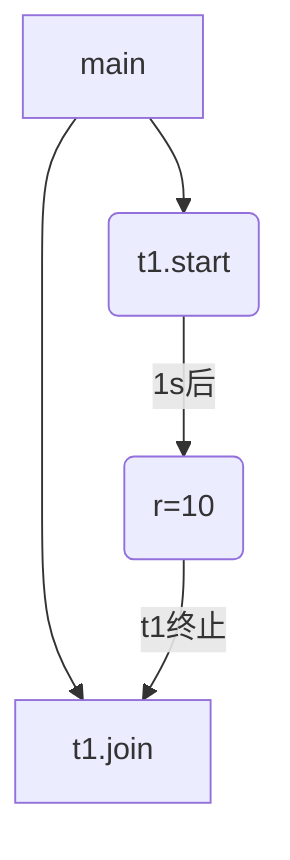

# java并发

## 1. 进程与线程

**进程**

```
程序由指令和数据组成，但这些指令要运行，数据要读写，就必须将指令加载至 CPU，数据加载至内存。在
指令运行过程中还需要用到磁盘、网络等设备。进程就是用来加载指令、管理内存、管理 IO 的
当一个程序被运行，从磁盘加载这个程序的代码至内存，这时就开启了一个进程。
进程就可以视为程序的一个实例。大部分程序可以同时运行多个实例进程（例如记事本、画图、浏览器
等），也有的程序只能启动一个实例进程（例如网易云音乐、360 安全卫士等）
```

**线程**

```
一个进程之内可以分为一到多个线程。
一个线程就是一个指令流，将指令流中的一条条指令以一定的顺序交给 CPU 执行
Java 中，线程作为最小调度单位，进程作为资源分配的最小单位。 在 windows 中进程是不活动的，只是作
为线程的容器
```

**二者对比**

```
进程基本上相互独立的，而线程存在于进程内，是进程的一个子集
进程拥有共享的资源，如内存空间等，供其内部的线程共享
进程间通信较为复杂
同一台计算机的进程通信称为 IPC（Inter-process communication）
不同计算机之间的进程通信，需要通过网络，并遵守共同的协议，例如 HTTP
线程通信相对简单，因为它们共享进程内的内存，一个例子是多个线程可以访问同一个共享变量
线程更轻量，线程上下文切换成本一般上要比进程上下文切换低
```

### **并发并行**

```
并发（concurrent）是同一时间应对（dealing with）多件事情的能力
并行（parallel）是同一时间动手做（doing）多件事情的能力
```

### 同步异步

```
以调用方角度来讲，如果
需要等待结果返回，才能继续运行就是同步
不需要等待结果返回，就能继续运行就是异步
```

```
1. 单核 cpu 下，多线程不能实际提高程序运行效率，只是为了能够在不同的任务之间切换，不同线程轮流使用
cpu ，不至于一个线程总占用 cpu，别的线程没法干活
2. 多核 cpu 可以并行跑多个线程，但能否提高程序运行效率还是要分情况的
有些任务，经过精心设计，将任务拆分，并行执行，当然可以提高程序的运行效率。但不是所有计算任
务都能拆分（参考后文的【阿姆达尔定律】）
也不是所有任务都需要拆分，任务的目的如果不同，谈拆分和效率没啥意义
3. IO 操作不占用 cpu，只是我们一般拷贝文件使用的是【阻塞 IO】，这时相当于线程虽然不用 cpu，但需要一
直等待 IO 结束，没能充分利用线程。所以才有后面的【非阻塞 IO】和【异步 IO】优化
```

### Java线程

方法一、继承 Thread类

```java
public class Create01 extends Thread{
    @Override
    public void run() {
        for (int i = 0; i < 100; i++) {
            System.out.println("子线程"+i);
        }
    }
}
Create01 c01=new Create01();
        c01.start();
        for (int i = 0; i < 100; i++) {
            System.out.println("主线程"+i);
        }
```

方法二、实现Runnable 接口

```java
public class Create02 implements Runnable{
    @Override
    public void run() {
        for (int i = 0; i < 100; i++) {
            System.out.println("子线程"+i);
        }
    }
}
Create02 c02=new Create02();
        Thread thread=new Thread(c02);
        thread.start();
        for (int i = 0; i < 100; i++) {
            System.out.println("主线程"+i);
        }
```

原理之 Thread 与 Runnable 的关系

```
分析 Thread 的源码，理清它与 Runnable 的关系
小结
方法1 是把线程和任务合并在了一起，方法2 是把线程和任务分开了
用 Runnable 更容易与线程池等高级 API 配合
用 Runnable 让任务类脱离了 Thread 继承体系，更灵活
```

方法三，FutureTask 配合 Thread

```java
// 创建任务对象
FutureTask<Integer> task3 = new FutureTask<>(() -> {
log.debug("hello");
return 100;
});
// 参数1 是任务对象; 参数2 是线程名字，推荐
new Thread(task3, "t3").start();
// 主线程阻塞，同步等待 task 执行完毕的结果
Integer result = task3.get();
log.debug("结果是:{}", result);
```

### 查看进程线程的方法

**windows**

- 任务管理器可以查看进程和线程数，也可以用来杀死进程

- tasklist 查看进程

- taskkill 杀死进程

**linux**

-   ps -fe 查看所有进程

- ps -fT -p <PID> 查看某个进程（PID）的所有线程

- kill 杀死进程

- top 按大写 H 切换是否显示线程

- top -H -p <PID> 查看某个进程（PID）的所有线程

**Java**

-   jps 命令查看所有 Java 进程

-  jstack <PID> 查看某个 Java 进程（PID）的所有线程状态
-   jconsole 来查看某个 Java 进程中线程的运行情况（图形界面）

**线程上下文切换（Thread Context Switch）**

因为以下一些原因导致 cpu 不再执行当前的线程，转而执行另一个线程的代码

- 线程的 cpu 时间片用完
- 垃圾回收
- 有更高优先级的线程需要运行
- 线程自己调用了 sleep、yield、wait、join、park、synchronized、lock 等方法

当 Context Switch 发生时，需要由操作系统保存当前线程的状态，并恢复另一个线程的状态，Java 中对应的概念
就是程序计数器（Program Counter Register），它的作用是记住下一条 jvm 指令的执行地址，是线程私有的

- 状态包括程序计数器、虚拟机栈中每个栈帧的信息，如局部变量、操作数栈、返回地址等
- Context Switch 频繁发生会影响性能多路复用

### 线程状态


```
线程休眠 Thread.sleep(1000)
线程放弃 Thread.yield()
加入 对象.join() 直到加入线程执行完毕
设置线程优先级 对象.setPriority
```

java六种状态

```
NEW 线程刚被创建，但是还没有调用 start() 方法
RUNNABLE 当调用了 start() 方法之后，注意，Java API 层面的 RUNNABLE 状态涵盖了 操作系统 层面的
【可运行状态】、【运行状态】和【阻塞状态】（由于 BIO 导致的线程阻塞，在 Java 里无法区分，仍然认为
是可运行）
BLOCKED ， WAITING ， TIMED_WAITING 都是 Java API 层面对【阻塞状态】的细分
TERMINATED 当线程代码运行结束
```

start和run方法

```
直接调用 run 是在主线程中执行了 run，没有启动新的线程
使用 start 是启动新的线程，通过新的线程间接执行 run 中的代码
```

sleep 与 yield

```
sleep
1. 调用 sleep 会让当前线程从 Running 进入 Timed Waiting 状态（阻塞）
2. 其它线程可以使用 interrupt 方法打断正在睡眠的线程，这时 sleep 方法会抛出 InterruptedException
3. 睡眠结束后的线程未必会立刻得到执行
4. 建议用 TimeUnit 的 sleep 代替 Thread 的 sleep 来获得更好的可读性
yield
1. 调用 yield 会让当前线程从 Running 进入 Runnable 就绪状态，然后调度执行其它线程
2. 具体的实现依赖于操作系统的任务调度器
```

线程优先级

- 线程优先级会提示（hint）调度器优先调度该线程，但它仅仅是一个提示，调度器可以忽略它
- 如果 cpu 比较忙，那么优先级高的线程会获得更多的时间片，但 cpu 闲时，优先级几乎没作用

join

```java
static int r = 0;
public static void main(String[] args) throws InterruptedException {
test1();
}
private static void test1() throws InterruptedException {
log.debug("开始");
Thread t1 = new Thread(() -> {
log.debug("开始");
sleep(1);
log.debug("结束");
r = 10;
});
t1.start();
log.debug("结果为:{}", r);
log.debug("结束");
}
```



多线程同步join


有时效的join

```
join(n) 最多等待n毫秒 线程提前结束，不需要等待那么长时间
```

interrupt 方法详解

```
打断 sleep，wait，join 的线程
这几个方法都会让线程进入阻塞状态
打断 sleep 的线程, 会清空打断状态 false
打断正常运行的线程, 不会清空打断状态 true
```

打断 park 线程

```
打断 park 线程, 不会清空打断状态
```

不推荐的方法

```
还有一些不推荐使用的方法，这些方法已过时，容易破坏同步代码块，造成线程死锁
```

```
方法名static   功能说明
stop()        停止线程运行
suspend()     挂起（暂停）线程运行
resume()      恢复线程运行
```

### 死锁

```
是指多个进程在运行过程中因争夺资源而造成的一种僵局
```

原因

```
a. 竞争资源

系统中的资源可以分为两类：
可剥夺资源，是指某进程在获得这类资源后，该资源可以再被其他进程或系统剥夺，CPU和主存均属于可剥夺性资源；
另一类资源是不可剥夺资源，当系统把这类资源分配给某进程后，再不能强行收回，只能在进程用完后自行释放，如磁带机、打印机等。
产生死锁中的竞争资源之一指的是竞争不可剥夺资源（例如：系统中只有一台打印机，可供进程P1使用，假定P1已占用了打印机，若P2继续要求打印机打印将阻塞）
产生死锁中的竞争资源另外一种资源指的是竞争临时资源（临时资源包括硬件中断、信号、消息、缓冲区内的消息等），通常消息通信顺序进行不当，则会产生死锁

b. 进程间推进顺序非法

若P1保持了资源R1,P2保持了资源R2，系统处于不安全状态，因为这两个进程再向前推进，便可能发生死锁
例如，当P1运行到P1：Request（R2）时，将因R2已被P2占用而阻塞；当P2运行到P2：Request（R1）时，也将因R1已被P1占用而阻塞，于是发生进程死锁
```

死锁产生的4个必要条件

```
1. 互斥条件：进程要求对所分配的资源进行排它性控制，即在一段时间内某资源仅为一进程所占用。
2. 请求和保持条件：当进程因请求资源而阻塞时，对已获得的资源保持不放。
3. 不剥夺条件：进程已获得的资源在未使用完之前，不能剥夺，只能在使用完时由自己释放。
4. 环路等待条件：在发生死锁时，必然存在一个进程--资源的环形链。
```

预防死锁：

- 资源一次性分配：一次性分配所有资源，这样就不会再有请求了：（破坏请求条件）
- 只要有一个资源得不到分配，也不给这个进程分配其他的资源：（破坏请保持条件）
- 可剥夺资源：即当某进程获得了部分资源，但得不到其它资源，则释放已占有的资源（破坏不可剥夺条件）
- 资源有序分配法：系统给每类资源赋予一个编号，每一个进程按编号递增的顺序请求资源，释放则相反（破坏环路等待条件）

避免死锁:

- 预防死锁的几种策略，会严重地损害系统性能。因此在避免死锁时，要施加较弱的限制，从而获得 较满意的系统性能。由于在避免死锁的策略中，允许进程动态地申请资源。因而，系统在进行资源分配之前预先计算资源分配的安全性。若此次分配不会导致系统进入不安全的状态，则将资源分配给进程；否则，进程等待。其中最具有代表性的避免死锁算法是银行家算法。
- 银行家算法：首先需要定义状态和安全状态的概念。系统的状态是当前给进程分配的资源情况。因此，状态包含两个向量Resource（系统中每种资源的总量）和Available（未分配给进程的每种资源的总量）及两个矩阵Claim（表示进程对资源的需求）和Allocation（表示当前分配给进程的资源）。安全状态是指至少有一个资源分配序列不会导致死锁。当进程请求一组资源时，假设同意该请求，从而改变了系统的状态，然后确定其结果是否还处于安全状态。如果是，同意这个请求；如果不是，阻塞该进程知道同意该请求后系统状态仍然是安全的。

银行家算法


检测死锁

1. 首先为每个进程和每个资源指定一个唯一的号码；
2. 然后建立资源分配表和进程等待表。

解除死锁:

当发现有进程死锁后，便应立即把它从死锁状态中解脱出来，常采用的方法有：

- 剥夺资源：从其它进程剥夺足够数量的资源给死锁进程，以解除死锁状态；
- 撤消进程：可以直接撤消死锁进程或撤消代价最小的进程，直至有足够的资源可用，死锁状态.消除为止；所谓代价是指优先级、运行代价、进程的重要性和价值等。

## 2.共享模型之管程

### synchronized

为了避免临界区的竞态条件发生，有多种手段可以达到目的。

- 阻塞式的解决方案：synchronized，Lock
- 非阻塞式的解决方案：原子变量

```
synchronized即俗称的【对象锁】，它采用互斥的方式让同一时刻至多只有一个线程能持有【对象锁】，其它线程再想获取这个【对象锁】时就会阻塞住。这样就能保证拥有锁的线程可以安全的执行临界区内的代码，不用担心线程上下文切换
注意
虽然 java 中互斥和同步都可以采用 synchronized 关键字来完成，但它们还是有区别的：
1. 互斥是保证临界区的竞态条件发生，同一时刻只能有一个线程执行临界区代码
2. 同步是由于线程执行的先后、顺序不同、需要一个线程等待其它线程运行到某个点
```

```
synchronized(对象) 中的对象，可以想象为一个房间（room），有唯一入口（门）房间只能一次进入一人
进行计算，线程 t1，t2 想象成两个人
当线程 t1 执行到 synchronized(room) 时就好比 t1 进入了这个房间，并锁住了门拿走了钥匙，在门内执行
count++ 代码
这时候如果 t2 也运行到了 synchronized(room) 时，它发现门被锁住了，只能在门外等待，发生了上下文切
换，阻塞住了
这中间即使 t1 的 cpu 时间片不幸用完，被踢出了门外（不要错误理解为锁住了对象就能一直执行下去哦），
这时门还是锁住的，t1 仍拿着钥匙，t2 线程还在阻塞状态进不来，只有下次轮到 t1 自己再次获得时间片时才
能开门进入
当 t1 执行完 synchronized{} 块内的代码，这时候才会从 obj 房间出来并解开门上的锁，唤醒 t2 线程把钥
匙给他。t2 线程这时才可以进入 obj 房间，锁住了门拿上钥匙，执行它的 count-- 代码
```

方法上的 synchronized

```JAVA
class Test{
public synchronized void test() {
}
}
等价于
class Test{
public void test() {
synchronized(this) {
}
}
}
```

```java
class Test{
public synchronized static void test() {
}
}
等价于
class Test{
public static void test() {
synchronized(Test.class) {
}
}
}
```

### 线程安全分析

成员变量和静态变量是否线程安全？

- 如果它们没有共享，则线程安全
- 如果它们被共享了，根据它们的状态是否能够改变，又分两种情况
  - 如果只有读操作，则线程安全
  - 如果有读写操作，则这段代码是临界区，需要考虑线程安全

局部变量是否线程安全？

- 局部变量是线程安全的
- 但局部变量引用的对象则未必
  - 如果该对象没有逃离方法的作用访问，它是线程安全的	
  - 如果该对象逃离方法的作用范围，需要考虑线程安全

### Monitor 概念

Java 对象头

普通对象

| Object Header (64 bits) |                      |
| ----------------------- | -------------------- |
| Mark Word (32 bits)     | Klass Word (32 bits) |

数组对象

| Object Header (96 bits) |                    |                      |
| ----------------------- | ------------------ | -------------------- |
| Mark Word(32bits)       | Klass Word(32bits) | array length(32bits) |

Mark Word结构

| Mark Word (32 bits)                          | State              |
| -------------------------------------------- | ------------------ |
| hashcode:  25    age:4   biased_lock: 0   01 | Normal             |
| thread:23 epoch:2 age:4 biased_lock:1 01     | Biased             |
| ptr_to_lock_record:30  00                    | Lightweight Locked |
| ptr_to_heavyweight_monitor:30 10             | Heavyweight Locked |
| 11                                           | Marked for GC      |

| Mark Word (64 bits)                                          | State              |
| ------------------------------------------------------------ | ------------------ |
| unused：25 hashcode:  31    unused：1 age:4   biased_lock: 0   01 | Normal             |
| thread:54 epoch:2  unused：1 age:4 biased_lock:1 01          | Biased             |
| ptr_to_lock_record:62  00                                    | Lightweight Locked |
| ptr_to_heavyweight_monitor:62 10                             | Heavyweight Locked |
| 11                                                           | Marked for GC      |

原理

每个 Java 对象都可以关联一个 Monitor 对象，如果使用 synchronized 给对象上锁（重量级）之后，该对象头的
Mark Word 中就被设置指向 Monitor 对象的指针


- 刚开始 Monitor 中 Owner 为 null
- 当 Thread-2 执行 synchronized(obj) 就会将 Monitor 的所有者 Owner 置为 Thread-2，Monitor中只能有一
  个 Owner
- 在 Thread-2 上锁的过程中，如果 Thread-3，Thread-4，Thread-5 也来执行 synchronized(obj)，就会进入
  EntryList BLOCKED
- Thread-2 执行完同步代码块的内容，然后唤醒 EntryList 中等待的线程来竞争锁，竞争的时是非公平的
- 图中 WaitSet 中的 Thread-0，Thread-1 是之前获得过锁，但条件不满足进入 WAITING 状态的线程，后面讲
  wait-notify 时会分析

```
synchronized 必须是进入同一个对象的 monitor 才有上述的效果
不加 synchronized 的对象不会关联监视器，不遵从以上规则
```

### 轻量级锁

```
轻量级锁的使用场景：如果一个对象虽然有多线程要加锁，但加锁的时间是错开的（也就是没有竞争），那么可以
使用轻量级锁来优化。
轻量级锁对使用者是透明的，即语法仍然是 synchronized
假设有两个方法同步块，利用同一个对象加锁
```

```java
static final Object obj = new Object();
public static void method1() {
synchronized( obj ) {
// 同步块 A
method2();
}
}
public static void method2() {
synchronized( obj ) {
// 同步块 B
}
}
```

- 创建锁记录（Lock Record）对象，每个线程都的栈帧都会包含一个锁记录的结构，内部可以存储锁定对象的
  Mark Word


- 让锁记录中 Object reference 指向锁对象，并尝试用 cas 替换 Object 的 Mark Word，将 Mark Word 的值存
  入锁记录


- 如果 cas 替换成功，对象头中存储了锁记录地址和状态 00 ，表示由该线程给对象加锁，这时图示如下


- 如果 cas 失败，有两种情况
  如果是其它线程已经持有了该 Object 的轻量级锁，这时表明有竞争，进入锁膨胀过程
  如果是自己执行了 synchronized 锁重入，那么再添加一条 Lock Record 作为重入的计数


- 当退出 synchronized 代码块（解锁时）如果有取值为 null 的锁记录，表示有重入，这时重置锁记录，表示重
  入计数减一


- 当退出 synchronized 代码块（解锁时）锁记录的值不为 null，这时使用 cas 将 Mark Word 的值恢复给对象
  头
  成功，则解锁成功
  失败，说明轻量级锁进行了锁膨胀或已经升级为重量级锁，进入重量级锁解锁流程

### 锁膨胀

```
如果在尝试加轻量级锁的过程中，CAS 操作无法成功，这时一种情况就是有其它线程为此对象加上了轻量级锁（有
竞争），这时需要进行锁膨胀，将轻量级锁变为重量级锁。
```

- 当 Thread-1 进行轻量级加锁时，Thread-0 已经对该对象加了轻量级锁


- 这时 Thread-1 加轻量级锁失败，进入锁膨胀流程
  即为 Object 对象申请 Monitor 锁，让 Object 指向重量级锁地址
  然后自己进入 Monitor 的 EntryList BLOCKED


- 当 Thread-0 退出同步块解锁时，使用 cas 将 Mark Word 的值恢复给对象头，失败。这时会进入重量级解锁
  流程，即按照 Monitor 地址找到 Monitor 对象，设置 Owner 为 null，唤醒 EntryList 中 BLOCKED 线程

### 自旋优化

```
重量级锁竞争的时候，还可以使用自旋来进行优化，如果当前线程自旋成功（即这时候持锁线程已经退出了同步
块，释放了锁），这时当前线程就可以避免阻塞。
```


- 自旋会占用 CPU 时间，单核 CPU 自旋就是浪费，多核 CPU 自旋才能发挥优势。
- 在 Java 6 之后自旋锁是自适应的，比如对象刚刚的一次自旋操作成功过，那么认为这次自旋成功的可能性会
  高，就多自旋几次；反之，就少自旋甚至不自旋，总之，比较智能。
- Java 7 之后不能控制是否开启自旋功能

### 偏向锁

```
轻量级锁在没有竞争时（就自己这个线程），每次重入仍然需要执行 CAS 操作。
Java 6 中引入了偏向锁来做进一步优化：只有第一次使用 CAS 将线程 ID 设置到对象的 Mark Word 头，之后发现
这个线程 ID 是自己的就表示没有竞争，不用重新 CAS。以后只要不发生竞争，这个对象就归该线程所有
```

```java
static final Object obj = new Object();
public static void m1() {
synchronized( obj ) {
// 同步块 A
m2();
}
}
public static void m2() {
synchronized( obj ) {
// 同步块 B
m3();
}
}
public static void m3() {
synchronized( obj ) {
// 同步块 C
}
}
```


**偏向状态**


一个对象创建时：

- 如果开启了偏向锁（默认开启），那么对象创建后，markword 值为 0x05 即最后 3 位为 101，这时它的
  thread、epoch、age 都为 0
- 偏向锁是默认是延迟的，不会在程序启动时立即生效，如果想避免延迟，可以加 VM 参数 -
  XX:BiasedLockingStartupDelay=0 来禁用延迟
- 如果没有开启偏向锁，那么对象创建后，markword 值为 0x01 即最后 3 位为 001，这时它的 hashcode、
  age 都为 0，第一次用到 hashcode 时才会赋值

**撤销** 调用hashCode

```
正常状态对象一开始是没有 hashCode 的，第一次调用才生成
调用了对象的 hashCode，但偏向锁的对象 MarkWord 中存储的是线程 id，如果调用 hashCode 会导致偏向锁被
撤销
轻量级锁会在锁记录中记录 hashCode
重量级锁会在 Monitor 中记录 hashCode
```

**撤销** 其他线程使用偏向锁对象

```
当有其它线程使用偏向锁对象时，会将偏向锁升级为轻量级锁
```

**撤销** wait、notify

**批量重偏向**

```
如果对象虽然被多个线程访问，但没有竞争，这时偏向了线程 T1 的对象仍有机会重新偏向 T2，重偏向会重置对象
的 Thread ID
当撤销偏向锁阈值超过 20 次后，jvm 会这样觉得，我是不是偏向错了呢，于是会在给这些对象加锁时重新偏向至
加锁线程
```

**批量撤销**

```
当撤销偏向锁阈值超过 40 次后，jvm 会这样觉得，自己确实偏向错了，根本就不该偏向。于是整个类的所有对象
都会变为不可偏向的，新建的对象也是不可偏向的
```

```
锁消除优化
锁粗化
对相同对象多次加锁，导致线程发生多次重入，可以使用锁粗化方式来优化，这不同于之前讲的细分锁的粒度
```

### wait/notify

```java
obj.wait() 让进入 object 监视器的线程到 waitSet 等待
obj.notify() 在 object 上正在 waitSet 等待的线程中挑一个唤醒
obj.notifyAll() 让 object 上正在 waitSet 等待的线程全部唤醒

wait() 方法会释放对象的锁，进入 WaitSet 等待区，从而让其他线程就机会获取对象的锁。无限制等待，直到
notify 为止
wait(long n) 有时限的等待, 到 n 毫秒后结束等待，或是被 notify
```

wait和sleep区别

```
1) sleep 是 Thread 方法，而 wait 是 Object 的方法 2) sleep 不需要强制和 synchronized 配合使用，但 wait 需要
和 synchronized 一起用 3) sleep 在睡眠的同时，不会释放对象锁的，但 wait 在等待的时候会释放对象锁 4) 它们
状态 TIMED_WAITING
```

模版

```java
synchronized(lock) {
while(条件不成立) {
lock.wait();
}
// 干活
}
//另一个线程
synchronized(lock) {
lock.notifyAll();
}
```

### 保护性暂停

```
有一个结果需要从一个线程传递到另一个线程，让他们关联同一个 GuardedObject
如果有结果不断从一个线程到另一个线程那么可以使用消息队列（见生产者/消费者）
JDK 中，join 的实现、Future 的实现，采用的就是此模式
因为要等待另一方的结果，因此归类到同步模式
```


```java
class GuardedObject {
private Object response;
private final Object lock = new Object();
public Object get() {
synchronized (lock) {
// 条件不满足则等待
while (response == null) {
try {
lock.wait();
} catch (InterruptedException e) {
e.printStackTrace();
}
}
return response;
}
}
public void complete(Object response) {
synchronized (lock) {
// 条件满足，通知等待线程
this.response = response;
lock.notifyAll();
}
}
}
public static void main(String[] args) {
GuardedObject guardedObject = new GuardedObject();
new Thread(() -> {
try {
// 子线程执行下载
List<String> response = download();
log.debug("download complete...");
guardedObject.complete(response);
} catch (IOException e) {
e.printStackTrace();
}
}).start();
log.debug("waiting...");
// 主线程阻塞等待
Object response = guardedObject.get();
log.debug("get response: [{}] lines", ((List<String>) response).size());
}
```

### Park/Unpark

它们是 LockSupport 类中的方法

```java
// 暂停当前线程
LockSupport.park();
// 恢复某个线程的运行
LockSupport.unpark(暂停线程对象)
```

与 Object 的 wait & notify 相比

```
1. wait，notify 和 notifyAll 必须配合 Object Monitor 一起使用，而 park，unpark 不必
2. park & unpark 是以线程为单位来【阻塞】和【唤醒】线程，而 notify 只能随机唤醒一个等待线程，notifyAll
是唤醒所有等待线程，就不那么【精确】
3. park & unpark 可以先 unpark，而 wait & notify 不能先 notify
```

### ReentrantLock

相对于 synchronized 它具备如下特点

```
可中断
可以设置超时时间
可以设置为公平锁
支持多个条件变量
```

与 synchronized 一样，都支持可重入

```java
// 获取锁
reentrantLock.lock();
try {
// 临界区
} finally {
// 释放锁
reentrantLock.unlock();
}
```

条件变量

```
synchronized 中也有条件变量，就是我们讲原理时那个 waitSet 休息室，当条件不满足时进入 waitSet 等待
ReentrantLock 的条件变量比 synchronized 强大之处在于，它是支持多个条件变量的，这就好比
synchronized 是那些不满足条件的线程都在一间休息室等消息
而 ReentrantLock 支持多间休息室，有专门等烟的休息室、专门等早餐的休息室、唤醒时也是按休息室来唤
醒
使用要点：
await 前需要获得锁
await 执行后，会释放锁，进入 conditionObject 等待
await 的线程被唤醒（或打断、或超时）取重新竞争 lock 锁
竞争 lock 锁成功后，从 await 后继续执行
```

## 3. JMM

JMM 即 Java Memory Model，它定义了主存、工作内存抽象概念，底层对应着 CPU 寄存器、缓存、硬件内存、
CPU 指令优化等。
JMM 体现在以下几个方面

```
原子性 - 保证指令不会受到线程上下文切换的影响
可见性 - 保证指令不会受 cpu 缓存的影响
有序性 - 保证指令不会受 cpu 指令并行优化的影响
```

## 4.无锁并发

### LongAdder

```java
// 累加单元数组, 懒惰初始化
transient volatile Cell[] cells;
// 基础值, 如果没有竞争, 则用 cas 累加这个域
transient volatile long base;
// 在 cells 创建或扩容时, 置为 1, 表示加锁
transient volatile int cellsBusy;
```

## 5.共享模型之不可变

### final 的使用

```
发现该类、类中所有属性都是 final 的
属性用 final 修饰保证了该属性是只读的，不能修改
类用 final 修饰保证了该类中的方法不能被覆盖，防止子类无意间破坏不可变性
```

## 6. JUC

### AQS

```
全称是 AbstractQueuedSynchronizer，是阻塞式锁和相关的同步器工具的框架
```

## Volatile

### 解决变量不可见问题

1. 加锁

```java
synchronized (t){
                if (t.isFlag()){
                    System.out.println("主线程");
                }
            }
```

执行步骤

```
a. 线程获得锁

b. 清空工作内存

c.从主内存拷贝共享变量最新的值到工作内存成为副本

d. 执行代码

e. 将修改后的副本值刷新到主内存中

f.线程释放锁
```

2. volatile关键字

```
　　Java语言提供了一种稍弱的同步机制，即volatile变量，用来确保将变量的更新操作通知到其他线程。当把变量声明为volatile类型后，编译器与运行时都会注意到这个变量是共享的，因此不会将该变量上的操作与其他内存操作一起重排序。volatile变量不会被缓存在寄存器或者对其他处理器不可见的地方，因此在读取volatile类型的变量时总会返回最新写入的值。
```


当对非 volatile 变量进行读写的时候，每个线程先从内存拷贝变量到CPU缓存中。如果计算机有多个CPU，每个线程可能在不同的CPU上被处理，这意味着每个线程可以拷贝到不同的 CPU cache 中。

　　而声明变量是 volatile 的，JVM 保证了每次读变量都从内存中读，跳过 CPU cache (副本)这一步。

```
1 线程a从主内存读取共享变量到对应的工作内存

2 对共享变量进行更改

3 线程a将修改后的值刷新到主内存，

4 线程b从主内存读取最新值，放入到对应工作内存
```

### 特性

1.保证此变量对所有的线程的可见性，这里的“可见性”，如本文开头所述，当一个线程修改了这个变量的值，volatile 保证了新值能立即同步到主内存，以及每次使用前立即从主内存刷新。但普通变量做不到这点，普通变量的值在线程间传递均需要通过主内存来完成。不保证原子性

2.禁止指令重排序优化。有volatile修饰的变量，赋值后多执行了一个“load addl $0x0, (%esp)”操作，这个操作相当于一个**内存屏障**（指令重排序时不能把后面的指令重排序到内存屏障之前的位置），只有一个CPU访问内存时，并不需要内存屏障；（什么是指令重排序：是指CPU采用了允许将多条指令不按程序规定的顺序分开发送给各相应电路单元处理）。

重排序的好处


重排序可能带来并发问题

### CAS

```
CAS全称是Compare and Swap，即比较并交换，是通过原子指令来实现多线程的同步功能，将获取存储在内存地址的原值和指定的内存地址进行比较，只有当他们相等时，交换指定的预期值和内存中的值，这个操作是原子操作，若不相等，则重新获取存储在内存地址的原值
```

```java
 public final int getAndAddInt(Object o, long offset, int delta) {
        int v;
        do {
            v = getIntVolatile(o, offset); // 拿到内存位置最新值
        } while (!weakCompareAndSetInt(o, offset, v, v + delta));// CAS修改成功才跳出循环
        return v;
    }
```

缺点

```
1. 循环时间长开销很大。
2. 只能保证一个变量的原子操作。
3. ABA问题。
```

1. ```
   CAS 通常是配合无限循环一起使用的，我们可以看到 getAndAddInt 方法执行时，如果 CAS 失败，会一直进行尝试。如果 CAS 长时间一直不成功，可能会给 CPU 带来很大的开销。
   ```

2. ```
   当对一个变量执行操作时，我们可以使用循环 CAS 的方式来保证原子操作，但是对多个变量操作时，CAS 目前无法直接保证操作的原子性。但是我们可以通过以下两种办法来解决：1）使用互斥锁来保证原子性；2）将多个变量封装成对象，通过 AtomicReference 来保证原子性。
   ```

3. ```
   CAS 的使用流程通常如下：1）首先从地址 V 读取值 A；2）根据 A 计算目标值 B；3）通过 CAS 以原子的方式将地址 V 中的值从 A 修改为 B。
   
   但是在第1步中读取的值是A，并且在第3步修改成功了，我们就能说它的值在第1步和第3步之间没有被其他线程改变过了吗？
   
   如果在这段期间它的值曾经被改成了B，后来又被改回为A，那CAS操作就会误认为它从来没有被改变过。这个漏洞称为CAS操作的“ABA”问题。Java并发包为了解决这个问题，提供了一个带有标记的原子引用类“AtomicStampedReference”，它可以通过控制变量值的版本来保证CAS的正确性。因此，在使用CAS前要考虑清楚“ABA”问题是否会影响程序并发的正确性，如果需要解决ABA问题，改用传统的互斥同步可能会比原子类更高效。
   ```

### 单例模式

9种写法

1. 饿汉单例1  静态常量 

```java
private static final Single01 instance=new Single01();
    private Single01(){
    }
    public static Single01 getInstance(){
        return instance;
    }
    public static void main(String[] args) {
        Single01 s1=Single01.getInstance();
        Single01 s2=Single01.getInstance();
        System.out.println(s1==s2);
    }
```

2. 饿汉单例2  静态代码块

```java
private static final Single02 instance;
    static {
        instance=new Single02();
    }
    private Single02(){
    }
    public static Single02 getInstance(){
        return instance;
    }
    public static void main(String[] args) {
        Single02 s1=Single02.getInstance();
        Single02 s2=Single02.getInstance();
        System.out.println(s1==s2);
    }
```

3. 懒汉单例 1 线程不安全

```java
private static Single03 instance=null;
    private Single03(){
    }
    public static Single03 getInstance(){
        if (instance==null){
            instance=new Single03();
        }
        return instance;
    }
    public static void main(String[] args) {
        Single03 s1= Single03.getInstance();
        Single03 s2= Single03.getInstance();
        System.out.println(s1==s2);
    }
```

4. 懒汉单例2 线程安全synchronized

```java
private static Single04 instance=null;
    private Single04(){
    }
    public synchronized static Single04 getInstance(){
        if (instance==null){
            instance=new Single04();
        }
        return instance;
    }
    public static void main(String[] args) {
        Single04 s1= Single04.getInstance();
        Single04 s2= Single04.getInstance();
        System.out.println(s1==s2);
    }
```

5. 懒汉单例3  线程不安全 单检查

```java
private static Single05 instance=null;
    private Single05(){
    }
    public static Single05 getInstance(){
        if (instance==null){
            synchronized (Single05.class){
                instance=new Single05();
            }
        }
        return instance;
    }
    public static void main(String[] args) {
        Single05 s1= Single05.getInstance();
        Single05 s2= Single05.getInstance();
        System.out.println(s1==s2);
    }
```

6. 懒汉单例4 线程不安全 双检查没有volatitle

```java
private static Single06 instance=null;
    private Single06(){
    }
    public static Single06 getInstance(){
        if (instance==null){
            synchronized (Single06.class){
                if (instance==null){
                    instance=new Single06();
                }
            }
        }
        return instance;
    }
    public static void main(String[] args) {
        Single06 s1= Single06.getInstance();
        Single06 s2= Single06.getInstance();
        System.out.println(s1==s2);
    }
```

7. 懒汉单例 线程安全 双检查+volatile

```java
private static volatile Single07 instance=null;
    private Single07(){
    }
    public static Single07 getInstance(){
        if (instance==null){
            synchronized (Single07.class){
                if (instance==null){
                    instance=new Single07();
                }
            }
        }
        return instance;
    }
    public static void main(String[] args) {
        Single07 s1= Single07.getInstance();
        Single07 s2= Single07.getInstance();
        System.out.println(s1==s2);
    }
```


8. 静态内部类

```java
private Single08(){
    }
    private static class Inner{
        private static final Single08 instance=new Single08();
    }
    public static Single08 getInstance(){
        return Inner.instance;
    }
    public static void main(String[] args) {
        Single08 s1= Single08.getInstance();
        Single08 s2= Single08.getInstance();
        System.out.println(s1==s2);
    }
```

9. 枚举实现

```java
public enum  EnumSingleton {
    INSTANCE;
    public EnumSingleton getInstance(){
        return INSTANCE;
    }
}
public class User {
    //私有化构造函数
    private User(){ }
 
    //定义一个静态枚举类
    static enum SingletonEnum{
        //创建一个枚举对象，该对象天生为单例
        INSTANCE;
        private User user;
        //私有化枚举的构造函数
        private SingletonEnum(){
            user=new User();
        }
        public User getInstnce(){
            return user;
        }
    }
 
    //对外暴露一个获取User对象的静态方法
    public static User getInstance(){
        return SingletonEnum.INSTANCE.getInstnce();
    }
}

public class Test {
    public static void main(String [] args){
        System.out.println(User.getInstance());
        System.out.println(User.getInstance());
        System.out.println(User.getInstance()==User.getInstance());
    }
}
结果为true
```
