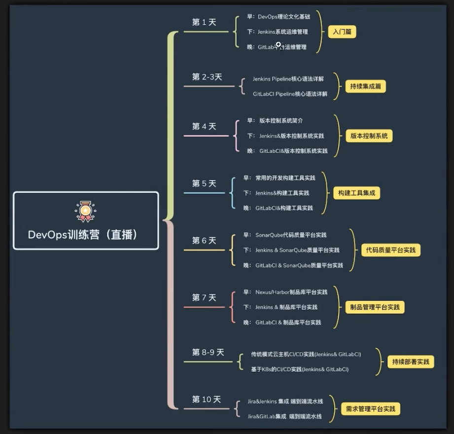

# devops

## 简介

DevOps是一种结合软件开发（Development）和信息技术运维（Operations）的方法论，旨在通过增强开发和运维团队之间的协作，来提高软件交付的速度、质量和可靠性。以下是DevOps的一些核心概念和特点：

1. **文化与协作**：DevOps提倡开发团队与运维团队之间的紧密合作，打破传统上两者之间的壁垒，促进更高效的沟通和协作。
2. **自动化**：DevOps强调在整个软件开发生命周期中使用自动化工具来加速测试、部署和监控。这可以减少人为错误，提高效率。
3. **持续集成与持续交付（CI/CD）**：DevOps通常采用CI/CD的实践，持续集成是指频繁将代码合并到主干，持续交付则是确保代码可以随时部署到生产环境中。
4. **监控与反馈**：在DevOps中，监控应用和基础设施的运行状况非常重要，以便及时发现问题并进行修复。同时，反馈的循环机制有助于团队不断改进。
5. **工具链**：DevOps通常会使用一系列工具（如Git、Docker、Jenkins、Kubernetes等）来支持开发、测试、部署和监控的各个阶段。

### 架构图


### 知识图谱



## 应用部署

### 部署运行

#### 打包上传

```bash
scp gradle-demo-0.0.1-SNAPSHOT.jar root@120.46.142.144:/root
```

#### 执行

```bash
java -jar gradle-demo-0.0.1-SNAPSHOT.jar &

查看运行程序
root@hcss-ecs-7780:~# ps aux | grep java
root        3456 10.2  7.3 3017440 133420 pts/0  Sl   00:13   0:05 java -jar gradle-demo-0.0.1-SNAPSHOT.jar
root        3490  0.0  0.1   6480  2200 pts/0    S+   00:13   0:00 grep --color=auto java

查看监听端口
root@hcss-ecs-7780:~# netstat -lpnt
Active Internet connections (only servers)
Proto Recv-Q Send-Q Local Address           Foreign Address         State       PID/Program name
tcp        0      0 127.0.0.53:53           0.0.0.0:*               LISTEN      464/systemd-resolve
tcp        0      0 0.0.0.0:22              0.0.0.0:*               LISTEN      1105/sshd: /usr/sbi
tcp6       0      0 :::8081                 :::*                    LISTEN      3456/java
tcp6       0      0 :::22                   :::*                    LISTEN      1105/sshd: /usr/sbi
```

### 创建非 root 账户

#### 添加用户

```bash
root@hcss-ecs-7780:~# adduser qiwen
Adding user `qiwen' ...
Adding new group `qiwen' (1000) ...
Adding new user `qiwen' (1000) with group `qiwen' ...
Creating home directory `/home/qiwen' ...
Copying files from `/etc/skel' ...
New password:
Retype new password:
passwd: password updated successfully
Changing the user information for qiwen
Enter the new value, or press ENTER for the default
	Full Name []: qiwen
	Room Number []:
	Work Phone []:
	Home Phone []:
	Other []:
Is the information correct? [Y/n] y

加入 sudo 组
usermod -aG sudo qiwen

切换用户
root@hcss-ecs-7780:~# su -u qiwen
Try 'su --help' for more information.
root@hcss-ecs-7780:~# su - qiwen
To run a command as administrator (user "root"), use "sudo <command>".
See "man sudo_root" for details.

qiwen@hcss-ecs-7780:~$
```

## 制品（artifact）

### NEXUS

#### 简介

```
Nexus Repository Manager 是一个用于管理和存储软件组件的仓库管理工具，广泛用于软件开发、构建和交付过程。Nexus 主要用于支持现代 DevOps 流程中的构件管理，帮助团队维护和分发依赖项、构建结果、和其他软件组件。以下是对 Nexus 的详细介绍：

1. 主要功能
多格式支持：Nexus 支持多种不同格式的仓库，包括：

Maven：用于 Java 项目的构建和依赖管理。
npm：用于 Node.js 应用程序的包管理。
Docker：用于存储和分发 Docker 镜像。
NuGet：用于 .NET 项目的包管理。
PyPI：用于 Python 包的管理。
其他格式，如 RubyGems、RPM 等。
组件缓存：Nexus 可以缓存从外部公共仓库下载的依赖项，从而加速构建过程并减少对外部网络的依赖。

版本控制：支持对每个组件的多个版本进行管理，确保依赖项的正确性和一致性。

安全和访问控制：提供强大的用户管理和访问控制功能，支持通过 LDAP、Active Directory 等方式进行用户身份验证，限制用户和组的访问权限。

REST API：提供丰富的 RESTful API 接口，允许开发人员和工具与 Nexus 进行交互，自动化仓库管理任务。
```

#### 安装

```bash
下载解压
nexus@hcss-ecs-7780:/opt$ ls
nexus-3.75.1-01  nexus-3.75.1-01-unix.tar.gz  sonatype-work
添加用户 nexus

adduser qiwen
usermod -aG sudo qiwen

chown -R nexus:nexus nexus-3.75.1-01
chown -R nexus:nexus sonatype-work
nexus@hcss-ecs-7780:/opt$ ls -l
total 233828
drwxr-xr-x 9 nexus nexus      4096 Dec 12 23:46 nexus-3.75.1-01
-rw-r--r-- 1 root  root  239429340 Dec 12 00:06 nexus-3.75.1-01-unix.tar.gz
drwxr-xr-x 3 nexus nexus      4096 Dec 12 00:07 sonatype-work

vim /opt/nexus-3.75.1-01/bin/nexus.rc
改成 nexus 用户： run_as_user="nexus"
```

#### 启动停止

##### 前台（可以看到错误提示）

```bash
./nexus run
报错：
nexus@hcss-ecs-7780:/opt/nexus-3.75.1-01/bin$ ./nexus run
OpenJDK 64-Bit Server VM warning: INFO: os::commit_memory(0x000000074f550000, 1890254848, 0) failed; error='Not enough space' (errno=12)
#
# There is insufficient memory for the Java Runtime Environment to continue.
# Native memory allocation (mmap) failed to map 1890254848 bytes. Error detail: committing reserved memory.
# An error report file with more information is saved as:
# /opt/nexus-3.75.1-01/hs_err_pid26774.log
```

##### 解决启动空间不足

1. **创建交换文件**

   创建一个交换文件，例如 2GB：

   ```bash
   sudo fallocate -l 2G /swapfile  
   ```

   如果 `fallocate` 命令不可用，您可以使用以下命令：

   ```bash
   sudo dd if=/dev/zero of=/swapfile bs=1G count=2  
   ```

2. **设置交换文件权限**

   为交换文件设置正确的权限：

   ```bash
   sudo chmod 600 /swapfile  
   ```

3. **设置交换区域**

   执行以下命令将文件设置为交换空间：

   ```bash
   sudo mkswap /swapfile  
   ```

4. **启用交换文件**

   现在启用交换文件：

   ```bash
   sudo swapon /swapfile  
   ```

5. **确认交换空间已启用**

   使用以下命令检查交换空间是否启用：

   ```bash
   free -h
   nexus@hcss-ecs-7780:/opt/nexus-3.75.1-01/bin$ free -h
                  total        used        free      shared  buff/cache   available
   Mem:           1.7Gi       191Mi       1.3Gi       2.0Mi       218Mi       1.4Gi
   Swap:          2.0Gi        70Mi       1.9Gi
   ```

   这时您应该会看到交换空间的可用量显示为 2GB。

6. **使交换文件在启动时自动启用**

   编辑 `/etc/fstab` 文件，以便在系统启动时自动启用交换文件：

   ```bash
   sudo nano /etc/fstab  
   ```

   在文件末尾添加以下行：

   ```bash
   /swapfile none swap sw 0 0  
   ```

##### 后台

```bash
./nexus start
# 停止
./nexus stop
```

##### 查看状态

```bash
ps aux | grep nexus

nexus      30288  156 77.2 5393536 1400416 pts/1 Sl   00:14   0:42 /usr/lib/jvm/java-17-openjdk-amd64/bin/java -server -Dinstall4j.jvmDir=/usr/lib/jvm/java-17-openjdk-amd64 -Dexe4j.moduleName=/opt/nexus-3.75.1-01/bin/nexus -XX:+UnlockDiagnosticVMOptions -Dinstall4j.launcherId=246 -Dinstall4j.swt=false     xxxxx

netstat -lnpt
tcp6       0      0 :::8081                 :::*                    LISTEN      30288/java
```

#### 使用系统服务启动

##### **基本特点**

- **系统服务启动**: 将 Nexus 配置为系统服务，使其能够在系统启动时自动运行，且不需要手动干预。这通常涉及到创建一个 systemd 单元文件（对于使用 systemd 的 Linux 发行版）来管理 Nexus 的启动和停止。
- **后台运行**: 服务启动后，Nexus 在后台运行，用户可以关闭终端而不影响 Nexus 的运行。
- **自启动功能**: 可以轻松配置为在系统引导时启动，确保每次重启系统时，Nexus 都会自动启动

##### **配置示例**

1. **创建 systemd 单元文件**:
   创建一个名为 `nexus.service` 的文件，并将其放在 `/etc/systemd/system/` 目录下：

   ```bash
   sudo vim /etc/systemd/system/nexus.service
   
   添加内容
   [Unit]  
   Description=Nexus Repository Manager  
   After=network.target  
   
   [Service]  
   Type=simple  
   User=nexus  
   Group=nexus  
   ExecStart=/opt/nexus-3.75.1-01/bin/nexus run  
   ExecStop=/opt/nexus-3.75.1-01/bin/nexus stop  
   Restart=on-abort  
   
   [Install]  
   WantedBy=multi-user.target
   
   
   将 ExecStart=/opt/nexus-3.75.1-01/bin/nexus start 改为 ExecStart=/opt/nexus-3.75.1-01/bin/nexus run 能够成功启动 Nexus 服务，主要是因为这两者在处理进程的方式上存在显著差异。以下是详细解释：
   
   1. start 与 run 的区别
   nexus start:
   
   此命令通常用于后台启动 Nexus 实例。
   它在提供服务的同时创建一个进程并会将控制权立即返回给调用方，进而可能导致服务在未能正确管理进程的情况下就退出。
   当用作 systemd 服务启动命令时，start 不会保持服务的前台输出，这使得 systemd 无法感知服务的实际状态，特别是在遇到错误时。此外，该命令也可能不会处理标准输出，因此不能捕获错误日志。
   nexus run:
   
   此命令用于在前台启动 Nexus 实例。
   它保持进程在当前终端输出日志，并一直运行，直到它被显式停止。由于 systemd 监控的是前台进程，因此可以更好地管理服务的启动和停止。
   当服务发生任何错误或崩溃时，systemd 可以及时捕捉到并记录这些信息，这有助于问题检测和调试。
   2. systemd 的工作原理
   systemd 需要对服务进程的状态进行监控，以决定是否重新启动、停止或记录错误。在后台运行的进程（例如 nexus start），由于其运行机制，systemd 恐怕无法得到正确的进程状态，导致其认为服务没有正常运行，从而立即停止该进程。
   ```

2. **启动和使能服务**:

   ```bash
   # 重新加载 systemd 管理器配置  
   sudo systemctl daemon-reload  
   
   # 启动 Nexus 服务  
   sudo systemctl start nexus
   
   # 查看状态
   sudo systemctl status nexus
   
   # 设置 Nexus 服务在系统启动时自动启动  
   sudo systemctl enable nexus
   ```

##### 总结

| 特性       | `/bin/nexus start` 启动          | 系统服务启动                       |
| ---------- | -------------------------------- | ---------------------------------- |
| 启动方式   | 手动命令行启动                   | 按配置文件自动启动                 |
| 后台运行   | 终端需要保持打开，日志在终端显示 | 自动在后台运行，关闭终端不影响运行 |
| 自动启动   | 不支持                           | 可配置自动启动                     |
| 适用环境   | 测试、开发环境                   | 生产环境                           |
| 控制和监控 | 可实时监控通过命令行             | 通过 `systemctl` 管理状态          |

#### 使用

###### 登录修改密码

```bash
nexus@hcss-ecs-7780:/opt/sonatype-work/nexus3$ cat /opt/sonatype-work/nexus3/admin.password
7f805815-34c0-4de0-8708-9f9fb19f33ca
```

##### 上传

build.gradle

```groovy
apply plugin: 'maven-publish'

publishing {
    publications {
        maven(MavenPublication) {
            artifact("build/libs/gradle-demo-${version}"+".jar") {
                extension 'jar'
            }
        }
    }

    repositories {
        maven {
            name 'nexus'
            url "http://120.46.142.144:8081/repository/maven-snapshots/"
            allowInsecureProtocol = true
            credentials {
                username project.repoUser
                password project.repoPassword
            }
        }
    }
}
```

gradle.properties

```properties
repoUser = admin
repoPassword = xxx
```

```bash
gradle build
gradle publish
```

pom.xml

```xml
<plugin>
      <groupId>org.apache.maven.plugins</groupId>
      <artifactId>maven-deploy-plugin</artifactId>
      <version>3.1.1</version>
  </plugin>
  <plugin>
      <groupId>org.apache.maven.plugins</groupId>
      <artifactId>maven-deploy-plugin</artifactId>
  </plugin>
```

settings.xml

```xml
<settings>
    <servers>
        <server>
            <id>nexus-snapshots</id>
            <username>admin</username>
            <password>xxx</password>
        </server>
    </servers>
</settings>
```

```
mvn package
mvn depoly
```


## jenkins

### Jenkins 简介

Jenkins是一个开源的自动化服务器，通常用于持续集成（CI）和持续交付（CD）的流程。它通过提供构建、测试和部署的自动化，帮助开发团队提高软件的发布速度和质量。Jenkins具有以下几个关键特点：

- **可扩展**：Jenkins拥有丰富的插件生态系统，可以通过数百个插件进行功能扩展，以支持多种开发、测试和部署工具。
- **易于使用**：Jenkins提供了用户友好的Web界面，便于用户配置构建任务和实时查看构建状态。
- **支持多种语言和平台**：Jenkins不依赖于特定的编程语言或平台，支持多种版本控制系统、构建工具和外部集成。
- **灵活的构建管道**：用户可以通过Jenkins Pipeline定义复杂的构建和部署流程，实现高度自定义的CI/CD管道。

### 安装

使用 docker 部署 Jenkins 默认在 8080 端口运行

```bash
docker run -d \
  --name jenkins \
  -p 8080:8080 \
  -p 50000:50000 \
  -v jenkins_home:/var/jenkins_home \
  jenkins/jenkins:lts
```

这个命令中：

- `-d`：让容器在后台运行。
- `--name jenkins`：为容器指定一个名称。
- `-p 8080:8080：将主机的 8080端口映射到容器的 8080端口（Jenkins Web界面的默认端口）。
- `-p 50000:50000`：将主机的50000端口映射到容器的50000端口（用于Jenkins代理的连接）。
- `-v jenkins_home:/var/jenkins_home`：使用Docker卷将数据持久化，以便在容器停止或删除后仍能保留数据。

#### 初始设置

1. 启动容器后，查看Jenkins的初始管理员密码：

   ```bash
   docker exec jenkins cat /var/jenkins_home/secrets/initialAdminPassword  
   ```

2. 打开浏览器，访问 `http://localhost:8080。

3. 在首次访问Jenkins时，输入之前获取的初始管理员密码。

4. 接下来，你可以选择安装推荐的插件或手动选择所需的插件，并创建第一个管理员用户。

### 配置从节点

https://hub.docker.com/r/jenkins/inbound-agent/

还可以启动一个 ubuntu 容器，内部安装 java，通过一下命令连接

```bash
curl -sO http://localhost:8080/jnlpJars/agent.jar;java -jar agent.jar -url http://localhost:8080/ -secret f4010ee5290fe7bc80bb7d11d204e35862474323d615b38f3261626e8a28518f -name build01 -workDir "/opt/jenkins"
```

#### 步骤 1：准备 Jenkins 主节点

确保您已经运行了 Jenkins 主节点。假设您已经按照之前的指示在 Docker 中成功运行了 Jenkins。

#### 步骤 2：启动 Jenkins 从节点

您可以使用以下命令启动 Jenkins 从节点容器。确保您将 `<JNLP_URL>` 和 `<SECRET>` 替换为从 Jenkins 主节点的具体值。这可以在 Jenkins 主页面的从节点配置中找到。

```bash
docker run -d --init --name jenkins-agent jenkins/inbound-agent -url http://jenkins-server:port -workDir=/home/jenkins/agent <secret> <agent name>
```

- **`-d`**：以后台模式运行容器。
- **`--init`**:重置子进程
- **`--name jenkins-agent`**：给从节点容器指定一个名称，方便管理。
- **`http://jenkins-server:port `**：指定 Jenkins 主节点的 URL和端口。
- **`-workDir=/home/jenkins/agent`**：设置远程目录。
- **`secret`**：密钥。
- **`agent name`**：节点名称。


