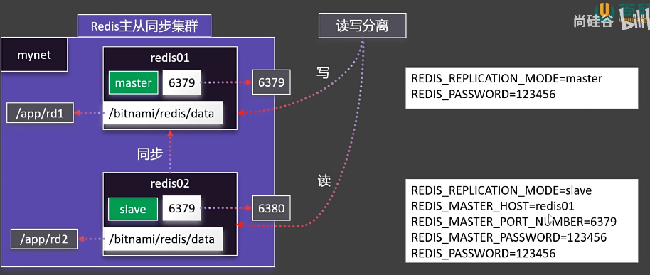
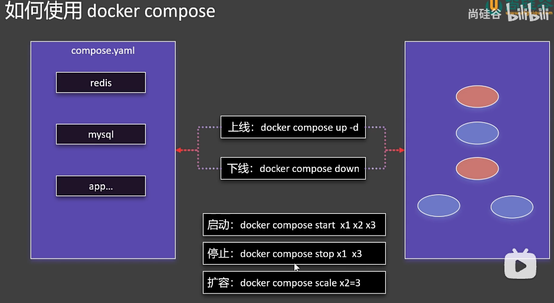
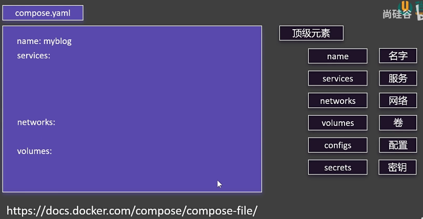
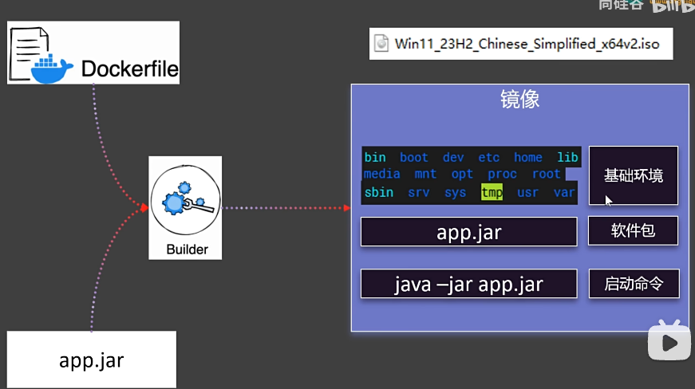
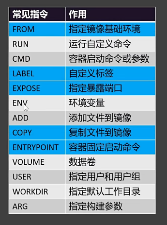
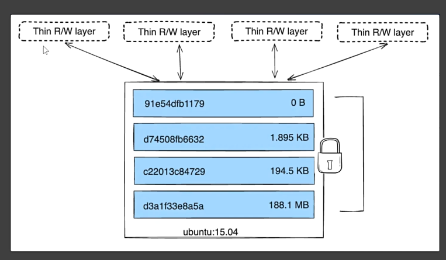

# docker


## docker架构

采用CS模式，使用远程api来管理和创建docker容器，docker容器通过docker镜像创建，容器于镜像的关系类似于面向对象编程中的对象与类

### docker基本概念

- 镜像（image）
- 容器（container）
- 仓库（Repository）

### 卸载旧版本

旧版本的 Docker 称为 `docker` 或者 `docker-engine`，使用以下命令卸载旧版本：

```shell
sudo apt-get remove docker \
               docker-engine \
               docker.io
```


### 安装docker

参考资料：https://docs.docker.com/engine/install/ubuntu/

https://yeasy.gitbook.io/docker_practice/install/ubuntu

#### 使用 APT 安装

由于 `apt` 源使用 HTTPS 以确保软件下载过程中不被篡改。因此，我们首先需要添加使用 HTTPS 传输的软件包以及 CA 证书。

```shell
sudo apt-get update

sudo apt-get install \
     apt-transport-https \
     ca-certificates \
     curl \
     gnupg \
     lsb-release
```

```shell
$ curl -fsSL https://mirrors.aliyun.com/docker-ce/linux/ubuntu/gpg | sudo gpg --dearmor -o /usr/share/keyrings/docker-archive-keyring.gpg


# 官方源
# $ curl -fsSL https://download.docker.com/linux/ubuntu/gpg | sudo gpg --dearmor -o /usr/share/keyrings/docker-archive-keyring.gpg
```

鉴于国内网络问题，强烈建议使用国内源，官方源请在注释中查看。

为了确认所下载软件包的合法性，需要添加软件源的 `GPG` 密钥

然后，我们需要向 `sources.list` 中添加 Docker 软件源

```shell
$ echo \
  "deb [arch=amd64 signed-by=/usr/share/keyrings/docker-archive-keyring.gpg] https://mirrors.aliyun.com/docker-ce/linux/ubuntu \
  $(lsb_release -cs) stable" | sudo tee /etc/apt/sources.list.d/docker.list > /dev/null


# 官方源
# $ echo \
#   "deb [arch=amd64 signed-by=/usr/share/keyrings/docker-archive-keyring.gpg] https://download.docker.com/linux/ubuntu \
#   $(lsb_release -cs) stable" | sudo tee /etc/apt/sources.list.d/docker.list > /dev/null 
```

> 以上命令会添加稳定版本的 Docker APT 镜像源，如果需要测试版本的 Docker 请将 stable 改为 test。

更新 apt 软件包缓存，并安装 `docker-ce`：

```shell
$ sudo apt-get update

$ sudo apt-get install docker-ce docker-ce-cli containerd.io
```

#### 使用脚本自动安装

在测试或开发环境中 Docker 官方为了简化安装流程，提供了一套便捷的安装脚本，Ubuntu 系统上可以使用这套脚本安装，另外可以通过 `--mirror` 选项使用国内源进行安装：

> 若你想安装测试版的 Docker, 请从 test.docker.com 获取脚本

```shell
# $ curl -fsSL test.docker.com -o get-docker.sh
$ curl -fsSL get.docker.com -o get-docker.sh
$ sudo sh get-docker.sh --mirror Aliyun
# $ sudo sh get-docker.sh --mirror AzureChinaCloud
```

执行这个命令后，脚本就会自动的将一切准备工作做好，并且把 Docker 的稳定(stable)版本安装在系统中。

### 建立 docker 用户组

默认情况下，`docker` 命令会使用 [Unix socket](https://en.wikipedia.org/wiki/Unix_domain_socket) 与 Docker 引擎通讯。而只有 `root` 用户和 `docker` 组的用户才可以访问 Docker 引擎的 Unix socket。出于安全考虑，一般 Linux 系统上不会直接使用 `root` 用户。因此，更好地做法是将需要使用 `docker` 的用户加入 `docker` 用户组。

建立 `docker` 组：

```shell
$ sudo groupadd docker
```

将当前用户加入 `docker` 组：

```bash
$ sudo usermod -aG docker $USER
```

退出当前终端并重新登录，进行如下测试。

```
sudo groupadd docker #添加docker用户组
sudo gpasswd -a $USER docker  #将登陆用户加入到docker用户组中
newgrp docker #更新用户组
docker images    #测试docker命令是否可以使用sudo正常使用
```

### docker镜像加速器

参考资料：https://cloud.tencent.com/document/product/1207/45596

## docker基础命令

参考资料：https://blog.csdn.net/leilei1366615/article/details/106267225

### **启动docker**

```bash
systemctl start docker
```

### **关闭docker**

```bash
systemctl stop docker
```

### **重启docker**

```bash
systemctl restart docker
```

### **docker设置随服务启动而自启动**

```bash
systemctl enable docker
```

### **查看docker 运行状态**

如果是在运行中 输入命令后 会看到绿色的active

```bash
systemctl status docker
```

### **查看docker 版本号信息**

```bash
docker version
docker info
```

### **docker 帮助命令**

```bash
docker --help
```

比如拉取命令 不知道可以带哪些参数 可以这样使用

```bash
docker pull --help
```

## docker镜像

### **列出镜像**

```bash
列出已经下载的镜像
docker images
docker image ls
```

### **搜索镜像**

```bash
docker search 镜像名
```

### **拉取镜像**

不加tag(版本号) 即拉取docker仓库中 该镜像的最新版本latest 加:tag 则是拉取指定版本

```
docker pull 镜像名 
docker pull 镜像名:tag
```

### **运行镜像**

```bash
docker run 镜像名
docker run 镜像名:Tag
```

### **删除镜像**

```bash
#删除一个
docker rmi -f 镜像名/镜像ID

#删除多个 其镜像ID或镜像用用空格隔开即可 
docker rmi -f 镜像名/镜像ID 镜像名/镜像ID 镜像名/镜像ID

#删除全部镜像  -a 意思为显示全部, -q 意思为只显示ID
docker rmi -f $(docker images -aq)
```

> 要删除的镜像必须确认此镜像目前没有被任何容器使用

### **强制删除镜像**

```bash
docker image rm 镜像名称/镜像ID
```

### **其他辅助命令**

查看本地镜像id

```bash
docker images -q
```

查看一个镜像制作历程

```bash
docker history 镜像名称
```

### 保存镜像

#### docker commit

```bash
docker commit -m "update index" 274 mynginx:v1.0
-m 添加提交信息
274 容器 id
mynginx:v1.0 镜像名称+版本
➜  docker docker images
REPOSITORY         TAG       IMAGE ID       CREATED              SIZE
mynginx            v1.0      3916a088ea2b   About a minute ago   197MB
```

#### docker save

```bash
docker save -o mynginx.tar mynginx:v1.0
-o mynginx.tar 输出的文件名
mynginx:v1.0 镜像名称+版本号
```

#### docker load

```bash
docker load -i mynginx.tar
-i mynginx.tar 加载文件
```

### 分享镜像

docker login

```bash
输入 docker hub 的账号密码
```

docker tag

```bash
docker tag mynginx:v1.0 username/mynginx:v1.0
```

docker push

```bash
docker push username/mynginx:v1.0
```

## docker容器

### 启动容器

```bash
docker run
# 细节
docker run 	-d  --name mynginx -p 88:80 nginx
-d: 后台启动
--name 给容器起一个名称
-p 将 host 的 88 端口映射到容器的 80 端口
```

### 查看容器

```bash
docker ps (运行中容器)
docker ps -a (所有容器，包括未运行的容器)
```

### 停止容器

```bash
docker stop 
```

### 启动容器

```bash
docker start
```

### 重启容器

```bash
docker restart （不管是启动的，还是未启动的）
```

### 查看容器状态

```bash
docker stats
```

### 查看日志

```bash
docker logs
```

### 进入容器

```bash
docker exec
# 细节
docker exec -it 容器名称 /bin/bash
--it 交互模式
/bin/bash 进入控制台
```

删除容器

```bash
docker rm
docker rm -f (强制删除容器)
```

### 挂载

在容器和主机修改都会生效 (启动时配置以外部host为准)

```bash
docker run -d -p 88:80 --name mynginx -v /Users/qiwenhuang/personal/docker/mount/nginx:/usr/share/nginx/html nginx:latest
-v 主机文件夹:容器文件夹
```

### 卷映射

在容器和主机修改都会生效

-v 卷名:/etc/nginx  (不以/开头docker会认为是卷) 在/var/lib/docker/volumns/卷名 （启动时配置以内部容器为准）

```bash
docker run -d -p 88:80 --name mynginx -v nginxConfig:/etc/nginx nginx
```

#### 列出所有卷名

```bash
docker volume ls
```

#### 创建卷名

```bash
docker volume create haha

docker volume ls
local     haha
local     jenkins_home
local     nginxConfig
```

#### 查看卷名详情

```bash
➜  nginx docker volume inspect haha
[
    {
        "CreatedAt": "2024-11-24T07:55:27Z",
        "Driver": "local",
        "Labels": null,
        "Mountpoint": "/var/lib/docker/volumes/haha/_data",
        "Name": "haha",
        "Options": null,
        "Scope": "local"
    }
]
```

#### 移除卷名

```bash
docker volume rm haha
docker volume rm -f nginxConfig （无效） 必须先删除容器
```

### docker 网络

172.17.0.2

172.17.0.3

docker为每一个容器分配了唯一 ip，使用容器 ip+容器端口可以互相访问

```bash
1、创建两个容器
2、查看容器状态
docker container inspect mynginx_01
"IPAddress": "172.17.0.2"
docker container inspect mynginx_02
"IPAddress": "172.17.0.3"
3、进入容器 01 输入， curl 172.17.0.3:80
xxx
<p><em>Thank you for using nginx.</em></p>
xxx
```

ip 由于各种原因可能会变化

docker0 默认不支持主机域名

创建自定义网络，容器名就是稳定的域名

##### 创建网络

```bash
docker network create mynet
docker run -d -p 88:80 --name mynginx_01 --network mynet  nginx
docker run -d -p 99:80 --name mynginx_02 --network mynet  nginx
docker exec -it 818  /bin/bash
curl http://mynginx_01:80 (访问 80端口)
```

##### 列举出网络

```bash
docker network ls
NETWORK ID     NAME             DRIVER    SCOPE
a337e693e6bd   bridge           bridge    local
695c09612e1a   gitlab_default   bridge    local
7251e0ce96e5   host             host      local
583e2698d8e7   kind             bridge    local
a86b24e8383b   mynet            bridge    local
bd65beb129fe   none             null      local
```

##### Redis 主从同步

bitnami/redis



**Master**

```bash
docker run -d -p 6379:6379 \
 -v /Users/qiwenhuang/personal/docker/redis/rd1:/bitnami/redis/data \
 -e REDIS_REPLICATION_MODE=master \
 -e REDIS_PASSWORD=123456 \
 --network mynet --name redis01 \
 bitnami/redis
```

**Slave**

```bash
docker run -d -p 6380:6379 \
 -v /Users/qiwenhuang/personal/docker/redis/rd2:/bitnami/redis/data \
 -e REDIS_REPLICATION_MODE=slave \
 -e REDIS_MASTER_HOST=redis01 \
 -e REDIS_MASTER_PORT_NUMBER=6379 \
 -e REDIS_MASTER_PASSWORD=123456 \
 -e REDIS_PASSWORD=123456 \
 --network mynet --name redis02 \
 bitnami/redis
```

```bash
➜  redis docker ps
CONTAINER ID   IMAGE                  COMMAND                   CREATED          STATUS          PORTS                       NAMES
3e540a270e8e   bitnami/redis          "/opt/bitnami/script…"   28 seconds ago   Up 27 seconds   0.0.0.0:6380->6379/tcp      redis02
6de2005f12f1   bitnami/redis          "/opt/bitnami/script…"   7 minutes ago    Up 7 minutes    0.0.0.0:6379->6379/tcp      redis01
```

### 配置 MySQL

```bash
docker run -d -p 3306:3306 \
-v /Users/qiwenhuang/personal/docker/mount/mysql/conf:/etc/mysql/conf.d \
-v /Users/qiwenhuang/personal/docker/mount/mysql/data:/var/lib/mysql \
-e MYSQL_ROOT_PASSWORD=123456 \
mysql

lsof -i :3306
kill xxx
kill -9 xxx
```

## docker compose

批量管理容器



### 结构



### 实例

```yaml
name: myblog
services:
  mysql:
    container_name: mysql
    image: mysql
    ports:
      - "3306:3306"
#    环境变量可以使用数组和 key value 形式
    environment:
      - MYSQL_ROOT_PASSWORD=123456
      - MYSQL_DATABASE=wordpress
    volumes:
      - mysql-data:/var/lib/mysql
      - /Users/qiwenhuang/personal/docker/mount/mysql/conf:/etc/mysql/conf.d
    restart: always
    networks:
      - blog

  wordpress:
    image: wordpress
    ports:
      - "8080:80"
    environment:
      WORDPRESS_DB_HOST: mysql
      WORDPRESS_DB_USER: root
      WORDPRESS_DB_PASSWORD: 123456
      WORDPRESS_DB_NAME: wordpress
    volumes:
      - wordpress:/var/www/html
    restart: always
    networks:
      - blog
#    依赖 mysql 先启动
    depends_on:
      - mysql
volumes:
  mysql-data:
  wordpress:
networks:
  blog:
```

### 启动

**功能**：创建并启动所有服务。

```bash
docker compose -f compose.yaml up -d
[+] Running 5/5
 ✔ Network myblog_blog           Created                                                               
 ✔ Volume "myblog_wordpress"     Created                                                               
 ✔ Volume "myblog_mysql-data"    Created                                                               
 ✔ Container mysql               Started                                                              
 ✔ Container myblog-wordpress-1  Started
 
 -f 指定配置文件， 不加默认是当前目录的 compose.yaml 文件， up启动容器 -d后台启动容器
```

#### 修改部分内容

```bash
➜  docker vim compose.yaml  （修改 wordpress 的端口，未修改 mysql）
➜  docker docker compose -f compose.yaml up -d
[+] Running 2/2
 ✔ Container mysql               Running                                                               
 ✔ Container myblog-wordpress-1  Started
 只启动修改的容器
```

### 开始

**功能**：启动已存在但已停止的服务容器

```bash
➜  docker docker compose -f compose.yaml start
[+] Running 2/2
 ✔ Container mysql               Started                                                                                                        0.2s
 ✔ Container myblog-wordpress-1  Started
```

### 停止

**功能**：停止一个或多个运行中的服务容器。

```bash
➜  docker docker compose -f compose.yaml stop
[+] Stopping 2/2
 ✔ Container myblog-wordpress-1  Stopped                                                               
 ✔ Container mysql               Stopped
```

### 销毁

- **功能**：停止并移除所有服务容器

```bash
➜  docker docker compose -f compose.yaml down -v
[+] Running 5/2
 ✔ Container myblog-wordpress-1  Removed                                                                
 ✔ Container mysql               Removed                                                               
 ✔ Volume myblog_wordpress       Removed                                                               
 ✔ Volume myblog_mysql-data      Removed                                                               
 ✔ Network myblog_blog           Removed

清理：此命令会停止所有服务并移除相关的容器
-v 或 --volumes：连同关联的卷一起删除。
--rmi：可以使用 --rmi all 删除所有服务的镜像，或者不使用此选项以保留镜像。
```

## dockerfile



### 常见指令



```bash
-t, --tag：为生成的镜像指定一个标签。格式为 name:tag，如果未指定 tag，默认值为 latest。

bash
docker build -t my-image:1.0 .  
-f, --file：指定 Dockerfile 的路径。如果 Dockerfile 不在上下文的根目录，可以使用此选项指定路径。

bash
docker build -f /path/to/Dockerfile .  
```


### 分层



Docker 映像是由多个层（Layer）逐层叠加而成的，每一层都是在其上面一层的基础上构建的。Dockerfile 中的每一条命令（如 `RUN`、`COPY`、`ADD` 等）都会创建一个新的层。这种层的构建和管理方式带来了多种好处，包括缓存、增量构建和共享。

#### Dockerfile 的分层机制原理

1. **层的概念**：
   - 每一层都是不可变的，一旦创建就不会被修改。每当对镜像进行更改时（例如添加文件），Docker 会创建一个新的层。
   - 每个层都是上一个层的增量更改，所有层共同组成了整个镜像。
2. **存储机制**：
   - Docker 使用联合文件系统（Union File System）来实现分层特性。这意味着操作系统在使用文件时，只需要读取新的增量层，而不是整个重新加载。例如，如果一个文件在上层被修改了，那么只需显示上层的内容，其它未更改的层依然保持不变。
3. **指令与层的创建**：
   - Dockerfile 中的每条指令都会生成一个新层：
     - `FROM`：定义基础镜像，不能与其它层合并。
     - `RUN`：执行命令并将其结果作为新层。
     - `COPY` 和 `ADD`：将文件添加到镜像中，创建新的层。
     - `CMD`、`ENTRYPOINT`：不创建新层，只定义容器启动时的行为。

#### 缓存机制

Docker 使用缓存来加快构建过程。当你执行 `docker build` 命令构建镜像时，Docker 会检查 Dockerfile 中的指令并检查每条指令的缓存：

1. **缓存的使用**：
   - 如果某条命令的上下文（例如其输入文件）没有改变，Docker 会重用之前构建的层，而不是重新执行这条命令。这能够大大加速构建时间。
   - 例如，如果您修改了 Dockerfile 中的一条命令，但下面的层未被更改，Docker 只会重新构建发生更改的那一层及上面的层。
2. **缓存失效**：
   - 一旦某个层被修改，层之上的所有层都需要重新构建。这种方式确保了镜像的一致性，但在某些情况下可能导致长时间的构建过程。

#### 图像的共享和复用

由于图像是分层的，多个 Docker 镜像可以共享相同的层。这意味着如果多个镜像使用相同的基础层，Docker 只会存储一次该层，从而节省存储空间。

#### 具体示例

考虑以下简单的 Dockerfile 示例：

```dockerfile
FROM ubuntu:20.04  

RUN apt-get update && apt-get install -y python3  

COPY . /app  

WORKDIR /app  

CMD ["python3", "app.py"]  
```

每一条指令的影响如下：

1. `FROM ubuntu:20.04`：
   - 创建一个新层基于 `ubuntu:20.04` 镜像。
2. `RUN apt-get update && apt-get install -y python3`：
   - 创建新层，安装 Python 3。如果相同的基础镜像已经有这个软件包（未发生版本更改），这一层会被缓存。
3. `COPY . /app`：
   - 创建新层，将当前目录下的文件复制到容器的 `/app` 目录。
4. `WORKDIR /app`：
   - 创建新层，设置工作目录，只是改变环境，不会增加文件。
5. `CMD ["python3", "app.py"]`：
   - 定义容器启动时的命令，不会创建新层。

#### 总结

- Dockerfile 的分层机制使得镜像的构建和管理更加灵活与高效。
- 可重用的层减少了存储需求，加速了构建过程，但必须小心更新和缓存的管理，以避免不必要的层重建。
- 通过理解分层机制，开发者可以编写更高效、优化的 Dockerfile，从而提高项目的可维护性和可扩展性。

## docker 实现原理

