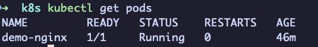
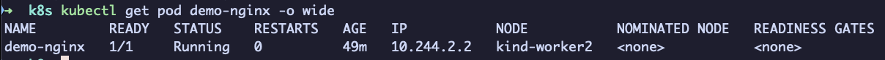
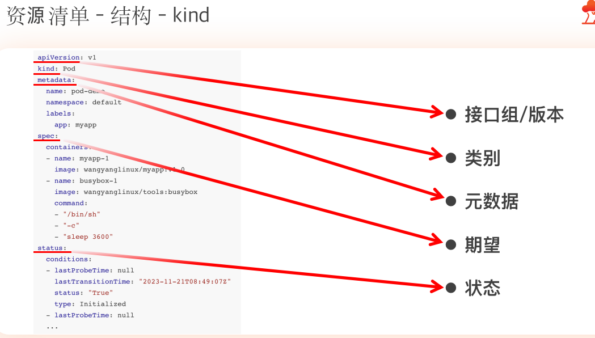
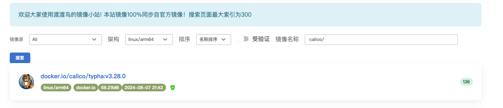
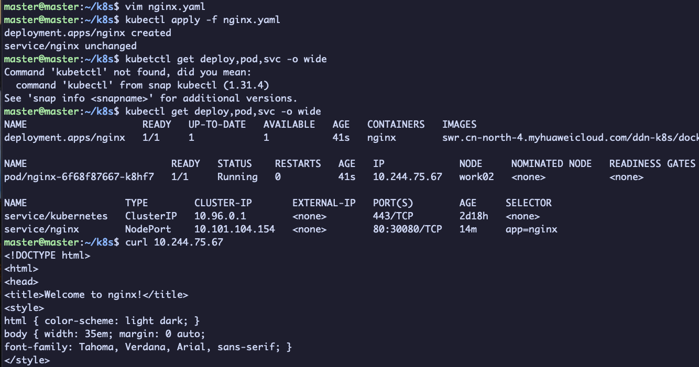

# k8s


## 安装 kind

`kind`（Kubernetes IN Docker）是一个工具，用于在 Docker 容器中运行 Kubernetes 集群，这使得在本地进行 Kubernetes 测试和开发变得非常方便。下面是 Mac 上安装 `kind` 的详细步骤说明

### 步骤 1: 安装 Docker

在安装 `kind` 之前，确保您的 Mac 上已安装 Docker。您可以从 [Docker 官网](https://www.docker.com/products/docker-desktop/) 下载 Docker Desktop 进行安装。

1. 前往 Docker 官网，下载安装文件。
2. 双击 `.dmg` 文件并将 Docker 图标拖入 Applications 文件夹。
3. 启动 Docker Desktop，并按照屏幕上的指示完成安装。

### 步骤 2: 安装 `kind`

您可以使用 Homebrew 或手动安装 `kind`。

#### 方法 1：使用 Homebrew 安装

安装 Homebrew 后，您可以通过以下命令安装 `kind`：

```bash
brew install kind  
```

#### 方法 2：手动安装

1. 打开终端。

2. 使用以下命令下载 `kind` 可执行文件：

   ```bash
   curl -Lo ./kind https://kind.sigs.k8s.io/dl/latest/kind-darwin-amd64  
   ```

3. 将下载的文件移动到 `/usr/local/bin` 目录并赋予执行权限：

   ```bash
   chmod +x ./kind  
   sudo mv ./kind /usr/local/bin/  
   ```

### 步骤 3: 验证安装

安装完成后，您可以通过以下命令验证 `kind` 是否安装成功：

```bash
kind version  
```

如果安装成功，您应该会看到类似于以下的输出：

```bash
kind v0.17.0  
```

（版本号可能会根据您安装的版本而有所不同。）

### 步骤 4: 创建一个 Kubernetes 集群

#### 创建自定义配置文件

要创建多节点集群，您需要使用一个配置文件来指定节点的数量和类型。下面是一个示例 YAML 文件，您可以将其命名为 `kind-config.yaml`：

```yaml
kind: Cluster  
apiVersion: kind.x-k8s.io/v1beta1  
Networking:  
  disableDefaultCNI: false  
nodes:  
  - role: control-plane  
  - role: worker  
  - role: worker  
```

#### 配置说明：

- `kind: Cluster`: 定义这是一个集群配置。

- `apiVersion`: API 版本。

- `Networking`: 这里可以配置网络相关的设置，这里是默认的 CNI。

- ```
  nodes
  ```

  : 定义集群中的节点。

  - 第一个节点的角色设为 `control-plane`，表示主节点。
  - 接下来的两个节点的角色设为 `worker`，表示工作节点。

#### 创建多节点集群

使用以下命令来创建基于您配置文件的多节点集群：

```bash
kind create cluster --config kind-config.yaml  
```

#### 验证集群状态

```bash
kubectl get nodes  
```

您应该能看到类似于以下的输出，显示所有节点的状态：

```bash
NAME                STATUS   ROLES                  AGE   VERSION  
kind-control-plane  Ready    control-plane         10m   v1.26.0  
kind-worker         Ready    worker                9m    v1.26.0  
kind-worker2        Ready    worker                9m    v1.26.0  
```

#### 使用集群

现在，您可以在多节点集群上进行测试和部署应用程序。

#### 删除集群

完成测试后，可以使用以下命令删除集群：

```bash
kind delete cluster  
```

## 创建 pod

以下是一个简单的 Kubernetes Pod YAML 文件示例，该 Pod 运行一个 Nginx 容器，您可以使用它来测试 Kubernetes Pod 的基本创建和运行。

```yaml
apiVersion: v1  
kind: Pod  
metadata:  
  name: demo-nginx  
  labels:  
    app: demo  
spec:  
  containers:  
    - name: nginx-container  
      image: nginx:latest  
      ports:  
        - containerPort: 80  
      resources:  
        limits:  
          memory: "256Mi"  
          cpu: "500m"  
      env:  
        - name: EXAMPLE_ENV  
          value: "Hello, Kubernetes!"  
```

### YAML 文件说明：

- `apiVersion`: 定义 API 版本，`v1` 是 Pod 的基本版本。

- `kind`: 资源类型，这里是 `Pod`。

- ```
  metadata
  ```

  : 包含 Pod 的元数据，如名称和标签。

  - `name`: Pod 的名称，您可以命名为 `demo-nginx`。
  - `labels`: 用于识别和选择 Pod 的标签。

- ```
  spec
  ```

  : 描述 Pod 的规范。

  - ```
    containers
    ```

    : 定义 Pod 中的容器。

    - `name`: 容器的名称。
    - `image`: 容器使用的镜像，这里使用 `nginx:latest`。
    - `ports`: 指定容器使用的端口，这里是 `80`。
    - `resources`: 资源限制，可以设置内存和 CPU 限制。
    - `env`: 环境变量，这里定义了一个示例环境变量 `EXAMPLE_ENV`。

### 创建

将上述 YAML 代码保存为 `pod-demo.yaml` 文件，然后使用以下命令创建 Pod：

```bash
kubectl apply -f pod-demo.yaml  
```

### 验证 Pod 状态

创建后，您可以使用以下命令验证 Pod 的状态：

```bash
kubectl get pods  
```



您应该能看到名为 `demo-nginx` 的 Pod 在运行中。

### 访问 Pod

要访问 Nginx 服务器，您需要在 Pod 上执行以下命令，获取 Pod 的 IP 地址：

```bash
kubectl get pod demo-nginx -o wide  
```



然后可以通过 Port Forwarding 来访问 Nginx：

```bash
kubectl port-forward pod/demo-nginx 8080:80  
```

#### 命令解释

- **kubectl**: Kubernetes 的命令行工具，用于与 Kubernetes 集群进行交互。
- **port-forward**: 这是一个子命令，用于设置端口转发。
- **pod/demo-nginx**: 指定了要进行端口转发的目标。这里我们将本地端口转发到名为 `demo-nginx` 的 Pod。格式为 `pod/<pod-name>` 指定一个 Pod，也可以使用 `deployment/<deployment-name>` 指定一个部署。
- **8080:80**: 这是一个端口映射：
  - `8080`: 是本地计算机上的端口号。
  - `80`: 是 Pod 内部服务的端口号（在这里假设 `demo-nginx` Pod 中的 Nginx 服务运行在 80 端口）

在浏览器中访问 `http://localhost:8080`，您应该会看到 Nginx 的欢迎页面。

> [!NOTE]
>
> 可能存在端口冲突，可以使用其他端口

#### curl

```bash
kubectl exec -it demo-nginx -- curl 10.244.2.2
本地创建 index 文件复制过去
kubectl cp index.html demo-nginx:/usr/share/nginx/html/index.html
```

### 清理资源

测试完成后，您可以通过以下命令删除 Pod：

```bash
kubectl delete -f pod-demo.yaml  
```

这样，您便成功创建并运行了一个简单的 Kubernetes Pod 示例。

## pod 的生命周期


## 命令

### 常见命令

```bash
# 获取当前的资源，pod
$ kubectl get pod 
	-A,--all-namespaces 查看当前所有名称空间的资源
	-n  指定名称空间，默认值 default，kube-system 空间存放是当前组件资源
	--show-labels  查看当前的标签
	-l  筛选资源，key、key=value
	-o wide  详细信息包括 IP、分配的节点
	-w  监视，打印当前的资源对象的变化部分
	
# 进入 Pod 内部的容器执行命令
$ kubectl exec -it podName -c cName -- command
	-c  可以省略，默认进入唯一的容器内部
	
# 查看资源的描述
$ kubectl explain pod.spec

# 查看 pod 内部容器的 日志
$ kubectl logs podName -c cName

# 查看资源对象的详细描述
$ kubectl describe pod podName

# 删除资源对象
$ kubectl delete kindName objName
	--all 删除当前所有的资源对象
```

### 进入 node

#### 通过 `docker exec` 进入节点

1. 首先，使用以下命令列出所有的 Docker 容器，包括 `kind` 创建的节点：

   ```bash
   docker ps  
   ```

   您将看到类似于如下的输出，列出所有正在运行的容器，其中包括控制平面节点和工作节点：

   ```bash
   CONTAINER ID   IMAGE                      COMMAND                  CREATED       STATUS       PORTS                                      NAMES  
   abc123456789   kindest/node:v1.26.0      "/usr/local/bin/entr…"   10 minutes ago Up 10 minutes 0.0.0.0:6443->6443/tcp                     kind-control-plane  
   def987654321   kindest/node:v1.26.0      "/usr/local/bin/entr…"   9 minutes ago  Up 9 minutes   0.0.0.0:6444->6444/tcp                     kind-worker  
   ```

2. 选择您要进入的节点的容器 ID（例如 `abc123456789`），然后使用 `docker exec` 命令进入节点。这是进入控制平面节点的示例：

   ```bash
   docker exec -it kind-control-plane /bin/sh  
   ```

   对于工作节点，您可以使用以下命令：

   ```bash
   docker exec -it kind-worker /bin/sh  
   ```

3. 设置环境变量

   ```bash
   export KUBECONFIG=/etc/kubernetes/kubelet.conf
   
   # 写入进去不用每次都 export
   echo "export KUBECONFIG=/etc/kubernetes/kubelet.conf" >> ~/.bashrc
   source ~/.bashrc
   ```

4. 进入节点后，您将在该节点的命令行中，您现在可以运行 Linux 命令或 Kubernetes 命令（如 `kubectl`）：

   ```bash
   # 例如，查看节点上的所有 pods  
    kubectl get pods --all-namespaces 
   ```

### 进入 Pod

如果您希望进入一个正在运行的 Pod，那么您可以使用以下命令：

1. 列出所有 pods：

   ```bash
   kubectl get pods --all-namespaces  
   ```

2. 找到您想要进入的 Pod 的名称，然后使用 `kubectl exec` 命令进入：

   ```bash
   kubectl exec -it <pod-name> -- /bin/sh  
   ```

   例如，如果您的 Pod 名称是 `nginx-pod`：

   ```bash
   kubectl exec -it nginx-pod -- /bin/sh  
   ```

这样，您就可以进入运行在 `kind` 集群节点或 Pods 中的容器了。

#### 退出节点或 Pod

- 在进入节点或 Pod 中，您可以使用 `exit` 命令退出。

# Kubernetes课程

## Pod

### **1. Pod 的概念**

#### **核心定义**

- **Pod 是容器的集合**：一个 Pod 可以包含一个或多个紧密关联的容器（例如主应用容器 + Sidecar 容器）。
- **共享上下文**：Pod 内的所有容器共享相同的网络命名空间（IP 和端口）、存储卷（Volumes）和部分 Linux 命名空间（如 IPC）。
- **最小调度单元**：Kubernetes 不直接调度容器，而是以 Pod 为单位调度到节点（Node）上。

#### **关键特性**

1. **共享网络**：
   - Pod 内的容器通过 `localhost` 直接通信，共享同一个 IP 地址和端口空间。
   - 例如：容器 A 监听 `localhost:8080`，容器 B 可以直接通过 `localhost:8080` 访问它。
2. **共享存储**：
   - Pod 可以定义共享的 Volume，容器可以挂载到相同或不同的路径。
   - 例如：容器 A 和 B 共享一个 `emptyDir` 卷，用于交换临时文件。
3. **生命周期一致性**：
   - Pod 内的容器同时启动和终止，共享相同的生命周期（但容器可能因故障提前终止）。

#### **设计理念**

- **协同进程模型**：Pod 内的容器像同一台物理机上的进程一样协同工作。
- **单一职责扩展**：将紧密耦合的功能拆分为多个容器（例如主应用 + 日志收集器），而不是将所有功能塞进单个容器。

------

### **2. `pause` 容器的工作原理**

#### **什么是 `pause` 容器？**

- `pause` 容器是一个轻量级的基础容器（镜像通常为 `k8s.gcr.io/pause`），是每个 Pod 的“根容器”。
- 它的唯一职责是 **为 Pod 内的其他容器提供共享的 Linux 命名空间**，并作为 Pod 内所有容器的父进程。

#### **核心作用**

1. **创建共享命名空间**：
   - 当 Kubernetes 创建 Pod 时，首先启动 `pause` 容器。
   - `pause` 容器初始化 Pod 的网络命名空间（Network Namespace）、IPC 命名空间等。
   - 其他容器通过 `--net=container:<pause-container-id>` 加入这个命名空间，共享网络栈。
2. **维护僵尸进程**：
   - 在 Linux 中，孤儿进程会被 PID 1 的进程接管。`pause` 容器作为 PID 1 的进程，负责回收僵尸进程，避免资源泄漏。
3. **Pod 生命周期管理**：
   - 如果 `pause` 容器终止，Pod 内的所有容器会被强制终止，Pod 状态变为 `Failed`。
   - Kubernetes 会重新调度该 Pod（根据重启策略）。

#### **为什么需要 `pause` 容器？**

- **命名空间共享**：通过一个中间容器固定命名空间，确保即使应用容器重启，Pod 的 IP 和端口也不会变化。
- **解耦依赖**：应用容器无需关心命名空间的创建和维持，专注于业务逻辑。
- **资源开销极低**：`pause` 容器几乎不消耗 CPU 和内存（仅约 100KB 内存）。

#### **工作流程示例**

1. 用户创建一个包含两个容器（A 和 B）的 Pod。
2. kubelet 首先启动 `pause` 容器，创建共享的网络/IPC 命名空间。
3. 容器 A 和 B 启动时，通过参数 `--net=container:<pause-id>` 加入 `pause` 容器的命名空间。
4. 容器 A 和 B 通过 `localhost` 直接通信，共享同一 IP 地址。

------

### **3. 总结**

- **Pod** 是 Kubernetes 的原子调度单位，通过共享命名空间和存储实现容器间紧密协作。
- **`pause` 容器** 是 Pod 的“基础设施容器”，负责维护共享命名空间和进程回收，是 Pod 网络和生命周期的基石。

通过这种设计，Kubernetes 既保持了容器轻量化的优势，又实现了多容器协同工作的高效抽象。

## 网络

Kubernetes 的网络模型要求每个 Pod 拥有独立且全局可达的 IP 地址，并支持跨节点直接通信。**Calico** 作为一款高性能的 **容器网络解决方案**，通过 **BGP（Border Gateway Protocol）协议** 和 **三层网络模型** 实现这一目标。以下从核心原理、组件架构、数据流和特性展开详细说明：

------

### 一、Calico 核心原理

1. **三层路由方案（非 Overlay）**
   - **无隧道封装**：Calico 采用纯三层路由（IP 路由）实现跨节点通信，数据包直接通过底层网络路由，**无需 VXLAN/IPIP 等隧道封装**，减少了网络性能损耗。
   - **BGP 协议**：通过 BGP 协议在节点间交换路由信息，使每个节点知晓如何到达其他节点上的 Pod。BGP 的 **AS（自治系统）模型** 适用于大规模集群。
2. **基于 IP 的细粒度网络策略**
   - 通过 **Calico Network Policies** 或 **Kubernetes Network Policies** 定义防火墙规则，控制 Pod 到 Pod、Pod 到外部的流量。

------

### 二、Calico 核心组件

1. **Felix**
   - **节点代理**：运行在每个节点上，负责配置路由、ACL（访问控制列表）、ARP 表等。
   - 与本地内核网络栈交互，确保 Pod 流量按预期转发。
2. **BIRD**
   - **BGP 客户端**：负责在节点间分发路由信息。每个节点通过 BIRD 向邻居节点宣告本节点 Pod 的 IP 段（如 `192.168.1.0/24`）。
   - 支持 **Route Reflectors**（路由反射器）模式，优化大规模集群的 BGP 路由分发。
3. **etcd 或 Kubernetes API**
   - **存储后端**：Calico 的配置数据（如网络策略、节点信息）可存储在 etcd 或直接通过 Kubernetes API 存储。
4. **CNI 插件**
   - 实现 Kubernetes CNI 接口，为 Pod 分配 IP 并配置网络命名空间。

------

### 三、数据流：Pod 跨节点通信

1. **Pod A 发送数据到 Pod B**

   - Pod A（IP `192.168.1.2`）发送数据包到 Pod B（IP `192.168.2.3`）。
   - 源节点路由表发现目标 IP 属于 `192.168.2.0/24`，下一跳指向目标节点的物理接口 IP（如 `10.0.0.2`）。
   - 数据包通过底层网络直接发送到目标节点，目标节点根据本地路由表将流量转发到 Pod B。

2. **关键路由表示例**

   bash

   复制

   ```
   # 在节点上查看路由表
   $ ip route
   192.168.1.0/24 via 10.0.0.1 dev eth0  # 本节点 Pod 网段
   192.168.2.0/24 via 10.0.0.2 dev eth0  # 其他节点 Pod 网段
   ```

------

### 四、IPIP 模式：跨子网通信

当节点位于不同子网时，Calico 可启用 **IPIP 隧道** 封装数据包：

- **原理**：将原始数据包封装在另一个 IP 包中，外层头部的源/目标 IP 为节点物理 IP。
- **命令启用 IPIP**：在 Calico 的 IPPool 配置中设置 `ipipMode: Always`。
- **性能影响**：IPIP 增加少量开销，但比 VXLAN 更高效。

------

### 五、核心优势

1. **高性能**
   - 无 Overlay 封装，延迟和吞吐量接近物理网络。
2. **灵活的网络策略**
   - 支持基于标签、命名空间、端口等维度的 ACL。
3. **可扩展性**
   - 通过 BGP 和 Route Reflectors 支持超大规模集群。
4. **多云兼容性**
   - 适用于公有云、私有云和混合云场景。

------

### 六、Calico 与其他方案对比

| 特性         | Calico                   | Flannel (VXLAN)    |
| :----------- | :----------------------- | :----------------- |
| **网络模型** | 三层路由（BGP）          | Overlay (VXLAN)    |
| **性能**     | 高（无封装）             | 中（有封装开销）   |
| **策略控制** | 强（内置 NetworkPolicy） | 弱（依赖其他组件） |
| **适用场景** | 大规模、高性能需求       | 简单中小集群       |

------

### 七、常见问题

1. **BGP 邻居未建立**
   - 检查节点间网络连通性，确保 TCP 179 端口开放。
2. **路由未正确分发**
   - 使用 `calicoctl node status` 查看 BGP 邻居状态。
3. **网络策略不生效**
   - 确认 Felix 日志，检查策略是否正确关联到 Pod。

------

### 总结

Calico 通过 **BGP 路由分发** 和 **三层网络模型**，提供了高性能、低延迟的容器网络方案，同时通过细粒度的网络策略实现安全隔离。其设计兼顾了灵活性与扩展性，是 Kubernetes 生产环境中的主流选择

### 资源清单



# 深入剖析 Kubernetes

## 容器技术基础

### cgroup 

#### 限制某个进程占用 20% 的 cpu 带宽 （Ubuntu22.04）

使用 ubuntu22.04 使用CGroup v2 限制 CPU 使用，以下是具体步骤，包括创建 CGroup、设置 CPU 限制以及将进程添加到该 CGroup 中。

##### 1. 创建 CGroup

首先，您需要创建一个新的 CGroup。您可以在 `/sys/fs/cgroup` 下创建一个新的 CGroup 目录：

```bash
sudo mkdir /sys/fs/cgroup/my_cgroup  

自动创建相应配置
qiwen@hcss-ecs-7780:/sys/fs/cgroup/my_cgroup$ ls
cgroup.controllers      cgroup.stat             cpu.pressure           cpu.uclamp.max   io.stat              memory.max           memory.swap.events
cgroup.events           cgroup.subtree_control  cpuset.cpus            cpu.uclamp.min   io.weight            memory.min           memory.swap.high
cgroup.freeze           cgroup.threads          cpuset.cpus.effective  cpu.weight       memory.current       memory.numa_stat     memory.swap.max
cgroup.kill             cgroup.type             cpuset.cpus.partition  cpu.weight.nice  memory.events        memory.oom.group     pids.current
cgroup.max.depth        cpu.idle                cpuset.mems            io.max           memory.events.local  memory.pressure      pids.events
cgroup.max.descendants  cpu.max                 cpuset.mems.effective  io.pressure      memory.high          memory.stat          pids.max
cgroup.procs            cpu.max.burst           cpu.stat               io.prio.class    memory.low           memory.swap.current
```

##### 2. 设置 CPU 限制

对于要限制的 CPU 使用比例（在这种情况下为 20%），您需要定义 `cpu.max` 文件。设置的方法是指定占用时间和周期。例如，20% 的 CPU 带宽可以表示为：

- **允许使用 20 毫秒的 CPU 时间**（20000 微秒）。
- **周期为 100 毫秒**（100000 微秒）。

您可以通过以下命令设置：

```bash
echo "20000 100000" | sudo tee /sys/fs/cgroup/my_cgroup/cpu.max  
```

这里的 `20000` 表示允许在每个 100 毫秒的周期中使用最大`20`毫秒的 CPU 时间。

##### 3. 将进程添加到 CGroup

找到您要限制的进程的 PID，然后将其添加到新创建的 CGroup 中。假设您要限制的进程的 PID 是 `12345`，可以使用以下命令：

```bash
# 模拟一个hang死进程
qiwen@hcss-ecs-7780:~$ while : ; do : ; done &
[1] 187495
echo 187495 | sudo tee /sys/fs/cgroup/my_cgroup/cgroup.procs  
```

此命令会将 PID 为 `187495` 的进程添加到 `my_cgroup` CGroup 中，从而限制其 CPU 使用。

#### 4. 验证设置

您可以通过查看 `cpu.max` 文件来确认设置是否正确：

```bash
设置前
top
    PID USER      PR  NI    VIRT    RES    SHR S  %CPU  %MEM     TIME+ COMMAND
 187495 qiwen     20   0    8792   3132   1280 R 100.0   0.2   0:08.08 bash
设置后
top
    PID USER      PR  NI    VIRT    RES    SHR S  %CPU  %MEM     TIME+ COMMAND
 187495 qiwen     20   0    8792   3132   1280 R  20.0   0.2   0:49.73 bash
```

### docker cgroup

```bash
启动 redis 容器
docker run -it  --cpu-period=10000 --cpu-quota=2000 e3a8e22dc404  /bin/bash

进入目录找到容器目录
qiwen@hcss-ecs-7780:/sys/fs/cgroup/system.slice$ ls
docker-81dcfd91f28f2fa64a3689526c9740493e4ec8ebedadbbe1c800f6f04f415ec7.scope

进入目录查询资源配置情况
qiwen@hcss-ecs-7780:/sys/fs/cgroup/system.slice/docker-81dcfd91f28f2fa64a3689526c9740493e4ec8ebedadbbe1c800f6f04f415ec7.scope$ cat cpu.max
2000 10000
```

### Linux容器

创建 app.py

```python
from flask import Flask

import socket
import os

app = Flask(__name__)


@app.route('/')
def hello():  # put application's code here
    html = "<h3>Hello {name}!</h3>" \
            "<b>Hostname:<b> {hostname}<br>"
    return html.format(name=os.getenv("NAME", "world"), hostname=socket.gethostname())

if __name__ == '__main__':
    app.run(host='0.0.0.0', port=80)
```

创建requirements.txt

```
Flask
```

创建Dockerfile

```dockerfile
# 使用官方提供的 python开发镜像作为基础镜像
FROM python:2.7-slim

# 将工作目录切换到/app
WORKDIR /app

# 将当前的目录下所有内容复制到/app下面
ADD . /app

# 使用 pip 安装这个应用所需要的依赖
RUN pip install --trusted-host pypi.python.org -r requirements.txt

# 允许外界访问 80端口
EXPOSE 80

# 设置环境变量
ENV NAME World

# 设置该容器进程为 python app.py
CMD ["python", "app.py"]
```

> [!NOTE]
>
> Docker默认提供一个ENTERPOINT 即 /bin/sh -c CMD 在不指定时，完整进程 /bin/bash -c "python app.py"

文件结构

```bash
qiwen@hcss-ecs-7780:~/docker$ ls
app.py  Dockerfile  requirements.txt
```

docker build

```bash
docker build -t helloworld .
[+] Building 16.3s (9/9) FINISHED                                                                       
xxxx
```

docker images

```bash
qiwen@hcss-ecs-7780:~/docker$ docker images
REPOSITORY                                                                TAG       IMAGE ID       CREATED              SIZE
helloworld                                                                latest    4cb362e04827   About a minute ago   907MB
```

docker run

```bash
docker run -p 4000:80 helloworld
```

查看容器 pid

```bash
qiwen@hcss-ecs-7780:~$ docker inspect --format '{{.State.Pid}}' 6b07509287e8
245855
```

查看进程 Namespace 对应的文件，对应的虚拟文件链接到一个真实的 Namespace 文件上面

```bash
qiwen@hcss-ecs-7780:~$ sudo ls -l /proc/245855/ns
[sudo] password for qiwen:
total 0
lrwxrwxrwx 1 root root 0 Dec 18 00:31 cgroup -> 'cgroup:[4026532618]'
lrwxrwxrwx 1 root root 0 Dec 18 00:31 ipc -> 'ipc:[4026532616]'
lrwxrwxrwx 1 root root 0 Dec 18 00:31 mnt -> 'mnt:[4026532614]'
lrwxrwxrwx 1 root root 0 Dec 18 00:31 net -> 'net:[4026532619]'
lrwxrwxrwx 1 root root 0 Dec 18 00:31 pid -> 'pid:[4026532617]'
lrwxrwxrwx 1 root root 0 Dec 18 00:31 pid_for_children -> 'pid:[4026532617]'
lrwxrwxrwx 1 root root 0 Dec 18 00:31 time -> 'time:[4026531834]'
lrwxrwxrwx 1 root root 0 Dec 18 00:31 time_for_children -> 'time:[4026531834]'
lrwxrwxrwx 1 root root 0 Dec 18 00:31 user -> 'user:[4026531837]'
lrwxrwxrwx 1 root root 0 Dec 18 00:31 uts -> 'uts:[4026532615]
```

docker exec 实现原理

```
将一个进程加入一个已经存在的 Namespace 中，从而进入该进程所在的容器
```

## 集群搭建与配置

### 参考

https://blog.csdn.net/m0_51510236/article/details/141671652

### 卸载

重置 Kubernetes 和卸载 containerd 需要一些具体的步骤。以下是详细的指南：

#### 1. 重置 Kubernetes 集群

如果您使用 `kubeadm` 安装的 Kubernetes，可以使用以下命令重置集群：

```bash
sudo kubeadm reset  
```

这将清除所有的 Kubernetes 配置和状态。

如果您希望删除所有的配置文件和残留的网络状态，您可以运行以下命令：

```bash
sudo rm -rf /etc/cni/net.d  
sudo rm -rf /var/lib/cni/  
sudo rm -rf /var/lib/kubelet/*  
```

#### 2. 卸载 Kubernetes 相关组件

如果您使用 `apt` 或 `yum` 安装了 Kubernetes 组件，例如 `kubelet`, `kubectl`, 和 `kubeadm`，可以使用以下命令卸载它们：

#### 对于 Debian/Ubuntu：

```
sudo apt-get purge kubeadm kubectl kubelet kubernetes-cni cri-tools  
```

#### 对于 CentOS/RHEL：

```bash
sudo yum remove kubeadm kubectl kubelet kubernetes-cni cri-tools  
```

#### 3. 卸载 Containerd

要卸载 containerd，可以使用以下步骤：

#### 对于 Debian/Ubuntu：

```bash
sudo apt-get purge containerd  
```

#### 对于 CentOS/RHEL：

```bash
sudo yum remove containerd  
```

#### 4. 清理残留文件

清理可能存在的配置和数据文件：

```bash
sudo rm -rf /etc/containerd  
sudo rm -rf /var/lib/containerd  
```

#### 5. 验证卸载

通过以下命令验证 containerd 是否已成功卸载：

```bash
containerd --version  
```

如果返回 “command not found”，则说明已成功卸载。

### 网络配置

1. 在 Ubuntu 虚拟机中打开终端。

2. 使用 `ip a` 命令查看当前 IP 地址和网络接口名称。

3. 编辑网络配置文件：

   ```bash
   sudo vim /etc/netplan/01-netcfg.yaml  
   ```

4. 根据需要手动设置不同的 IP 地址，例如：

   ```yaml
   network:  
     version: 2  
     renderer: networkd  
     ethernets:  
       enp0s3:  # 替换为您的网络接口名称 
         dhcp4: no  
         addresses: 
         	- 192.168.1.10/24  # 要设置的静态 IP 地址  
         gateway4: 192.168.1.1  # 您的网关  
         nameservers:  
           addresses: [8.8.8.8, 8.8.4.4]  
   ```

5. 保存更改并退出，然后应用配置：

   ```bash
   sudo netplan apply  
   ```

### 安装

#### 关闭防火墙

| 这个步骤所有服务器都要做

因为是内网安装，所以可以直接关闭防火墙。ubuntu下执行这行命令关闭并且永久关闭：

```bash
sudo systemctl disable --now ufw
```

#### 关闭Swap分区

| 这个步骤所有安装Kubernetes的节点都要执行，负载均衡节点选择性执行

**临时关闭**
执行下面命令可临时关闭Swap分区：

```bash
sudo swapoff -a
```

**永久关闭（配置未见）**

#### 时间同步

| 这个步骤所有的服务器都要做

设置上海时区
因为ubuntu默认时间并不是中国国内时区，所以需要执行这一行命令设置为中国上海时区：

```bash
sudo timedatectl set-timezone Asia/Shanghai
```

时间同步
首先需要安装ntpdate，执行下面命令安装：

```bash
sudo apt install -y ntpdate
```

执行下面命令进行时间同步：

```bash
sudo ntpdate ntp.aliyun.com
```

#### 修改hosts配置

| 这个步骤所有的服务器都要做

需要将所有服务器的服务器名和域名绑定一下，所以需要修改 `/etc/hosts` 文件，修改描述为：

```bash
# 127.0.1.1 work_01 （注释）
# k8s
192.168.1.10 master
192.168.1.11 work_01
192.168.1.12 work_02

尝试互相 ping
ping -c 3 master
```

#### 启用 IPv4 数据包转发

| 这个步骤所有k8s节点都要做

手动启用 IPv4 数据包转发：

```bash
设置所需的 sysctl 参数，参数在重新启动后保持不变
cat <<EOF | sudo tee /etc/sysctl.d/k8s.conf
net.ipv4.ip_forward = 1
EOF

应用 sysctl 参数而不重新启动
sudo sysctl --system
```


使用以下命令验证 net.ipv4.ip_forward 是否设置为 1：

```bash
sysctl net.ipv4.ip_forward
显示如下：
net.ipv4.ip_forward = 1
```

#### 安装Containerd

| 这个步骤所有k8s节点都要做

==注意是arm软件架构==

```bash
# 下载
curl -LO https://github.com/containerd/containerd/releases/download/v1.7.20/cri-containerd-cni-1.7.20-linux-arm64.tar.gz
# 解压
tar -zxvf cri-containerd-cni-1.7.20-linux-arm64.tar.gz -C /
# 查看版本号
sudo containerd --version
containerd github.com/containerd/containerd v1.7.20 8fc6bcff51318944179630522a095cc9dbf9f353

# 修改配置文件 因为安装后默认是不自带配置文件的，所以需要创建目录并生成配置文件。执行这行命令创建目录：
sudo mkdir /etc/containerd
# 然后执行这行命令生成配置文件：
containerd config default | sudo tee /etc/containerd/config.toml

sudo vim /etc/containerd/config.toml
# 因为默认的pause镜像是在谷歌上拉取的，国内拉取不下来，所以需要修改 /etc/containerd/config.toml 配置文件，将pause镜像改为 registry.aliyuncs.com/google_containers/pause:3.9
sandbox_image = "registry.aliyuncs.com/google_containers/pause:3.9"

# 然后需要开启cgroup，用于限制分配给进程的资源。将SystemCgroup设置为true：
SystemdCgroup = false ==> SystemdCgroup = true

# 启动containerd
# 执行这行命令启动containerd，并设置为开机自启动：
sudo systemctl enable --now containerd

# 查看状态
systemctl status containerd
```

#### 安装Kubernetes

| 这个步骤所有k8s节点都要做

```bash
sudo apt-get update
# apt-transport-https 可能是一个虚拟包（dummy package）；如果是的话，你可以跳过安装这个包
sudo apt-get install -y apt-transport-https ca-certificates curl gpg

# 下载用于 Kubernetes 软件包仓库的公共签名密钥。所有仓库都使用相同的签名密钥，因此你可以忽略URL中的版本：
# 如果 `/etc/apt/keyrings` 目录不存在，则应在 curl 命令之前创建它，请阅读下面的注释。
# sudo mkdir -p -m 755 /etc/apt/keyrings
curl -fsSL https://pkgs.k8s.io/core:/stable:/v1.30/deb/Release.key | sudo gpg --dearmor -o /etc/apt/keyrings/kubernetes-apt-keyring.gpg

# 添加 Kubernetes apt 仓库：
# 此操作会覆盖 /etc/apt/sources.list.d/kubernetes.list 中现存的所有配置。
echo 'deb [signed-by=/etc/apt/keyrings/kubernetes-apt-keyring.gpg] https://pkgs.k8s.io/core:/stable:/v1.30/deb/ /' | sudo tee /etc/apt/sources.list.d/kubernetes.list

# 更新 apt 包索引，安装 kubelet、kubeadm 和 kubectl，并锁定其版本：
sudo apt-get update
sudo apt-get install -y kubelet kubeadm kubectl
sudo apt-mark hold kubelet kubeadm kubectl

# 查看版本号
kubeadm version
kubeadm version: &version.Info{Major:"1", Minor:"30", GitVersion:"v1.30.8", GitCommit:"354eac776046f4268e9989b21f8d1bba06033379", GitTreeState:"clean", BuildDate:"2024-12-10T11:29:55Z", GoVersion:"go1.22.9", Compiler:"gc", Platform:"linux/arm64"}

GitVersion:"v1.30.8"为版本号
```

#### 拉取镜像

```bash
sudo kubeadm config images pull --image-repository=registry.aliyuncs.com/google_containers --kubernetes-version=v1.30.8
```

##### 使用 `ctr` 删除镜像

要删除命名空间 `k8s.io` 中的所有镜像，您可以使用如下命令：

首先，您可以列出所有镜像并查看它们的完整名称和标签（如果有的话）：

```bash
sudo ctr -n k8s.io images list  
```

##### 删除所有镜像

要删除 `k8s.io` 命名空间中的所有镜像，您可以结合使用 `ctr` 命令和 shell 的 `xargs` 命令来实现：

```bash
sudo ctr -n k8s.io images list -q | xargs -r sudo ctr -n k8s.io images remove  
```

==在主节点执行命令==

```bash
sudo kubeadm init \
--apiserver-advertise-address=192.168.1.10 \
--control-plane-endpoint="192.168.1.10:6443" \
--upload-certs \
--image-repository=registry.aliyuncs.com/google_containers \
--kubernetes-version=v1.30.8 \
--service-cidr=10.96.0.0/12 \
--pod-network-cidr=10.244.0.0/16 \
--cri-socket=unix:///run/containerd/containerd.sock

参数解释：
–apiserver-advertise-address：执行这行命令的主节点IP地址，注意修改为你自己的
–control-plane-endpoint：负载均衡apiserver的虚拟IP地址和端口，注意修改为自己的 没有负载均衡使用本机 ip 地址
–upload-certs：标志用来将在所有控制平面实例之间的共享证书上传到集群
–image-repository：因为官方镜像在谷歌，国内拉取不下来，所以使用国内的阿里云镜像
–kubernetes-version：Kubernetes的版本号
–service-cidr：Service的网段地址
–pod-network-cidr：pod的网段地址
–cri-socket：标志使用containerd作为容器运行时


# 初始化成功显示
mkdir -p $HOME/.kube
sudo cp -i /etc/kubernetes/admin.conf $HOME/.kube/config
sudo chown $(id -u):$(id -g) $HOME/.kube/config

# 输入 y
cp: overwrite '/home/master/.kube/config'? y
```

==加入从节点==

```bash
# 切换到从节点
sudo kubeadm join 192.168.1.10:6443 --token m2nlzz.kyuwxn45sviuso15 --discovery-token-ca-cert-hash sha256:810fbb88862441268585f5172d072421e6530822d8cb4eefe8804461aa99a749 --cri-socket=unix:///run/containerd/containerd.sock

mkdir -p $HOME/.kube
mkdir -p $HOME/.kube

# 切换到主节点复制配置文件
sudo scp /etc/kubernetes/admin.conf work_01@192.168.1.11:/home/work_01/.kube/config
sudo scp /etc/kubernetes/admin.conf work_02@192.168.1.12:/home/work_02/.kube/config

sudo chown $(id -u):$(id -g) $HOME/.kube/config
sudo chown $(id -u):$(id -g) $HOME/.kube/config

work_01@work01:~/k8s$ kubectl get nodes
NAME     STATUS   ROLES           AGE   VERSION
master   Ready    control-plane   66m   v1.30.8
work01   Ready    <none>          45m   v1.30.8
work02   Ready    <none>          43m   v1.30.8

kubectl get pods -n kube-system
NAME                             READY   STATUS              RESTARTS   AGE
coredns-cb4864fb5-jdjp8          1/1     Running             0          69m
coredns-cb4864fb5-qbf5x          1/1     Running             0          69m
etcd-master                      1/1     Running             10         69m
kube-apiserver-master            1/1     Running             10         69m
kube-controller-manager-master   1/1     Running             0          69m
kube-proxy-9szpb                 0/1     ContainerCreating   0          49m
kube-proxy-lbcll                 1/1     Running             0          69m
kube-proxy-qpf7n                 1/1     Running             0          47m
kube-scheduler-master            1/1     Running             10         69m

# token过期处理
# 加入集群的token有效期为1天，当过期后可以采用以下方式重新生成token：
kubeadm token create --print-join-command
```

##### 查看镜像架构

```bash
sudo ctr -n k8s.io  images list
xxxx linux/amd64,linux/arm/v7,linux/arm64,linux/ppc64le,linux/riscv64,linux/s390x io.cri-containerd.image=managed

# 删除镜像
sudo ctr -n k8s.io images rm <image-reference>
sudo ctr -n k8s.io images rm registry.cn-shenzhen.aliyuncs.com/xiaohh-docker/calico-cni:v3.28.1
# 查看删除状态
sudo ctr -n k8s.io images list | grep calico

```

#### 安装calico

如果你的节点数量小于等于50，执行下面这行命令安装calico：

```bash
kubectl create -f https://raw.githubusercontent.com/xiaohh-me/kubernetes-yaml/main/network/calico/calico-v3.28.1.yaml
如果你的节点数量大于50个，执行这行命令进行安装calico：
```

```bash
kubectl create -f https://raw.githubusercontent.com/xiaohh-me/kubernetes-yaml/main/network/calico/calico-typha-v3.28.1.yaml
```

> [!NOTE]
>
> 需要将其中image的镜像地址更换，因为本机是arm架构，镜像地址是amd架构

##### 查找镜像

安装架构，搜索calico

https://docker.aityp.com/i/search?site=All&platform=linux%2Farm64&sort=%E5%90%8D%E7%A7%B0%E6%8E%92%E5%BA%8F&search=calico%2F



##### 验证

```bash
master@master:~/k8s$ kubectl get pod -o wide -n kube-system
NAME                                       READY   STATUS    RESTARTS        AGE     IP             NODE     NOMINATED NODE   READINESS GATES
calico-kube-controllers-554d549c97-945bc   1/1     Running   0               17m     10.88.0.16     work01   <none>           <none>
calico-node-6r42q                          1/1     Running   0               17m     192.168.1.11   work01   <none>           <none>
calico-node-hbskk                          1/1     Running   0               17m     192.168.1.10   master   <none>           <none>
calico-node-tw22q                          1/1     Running   0               17m     192.168.1.12   work02   <none>           <none>
coredns-cb4864fb5-jdjp8                    1/1     Running   2 (163m ago)    2d18h   10.88.0.16     master   <none>           <none>
coredns-cb4864fb5-qbf5x                    1/1     Running   2 (163m ago)    2d18h   10.88.0.14     master   <none>           <none>
etcd-master                                1/1     Running   12 (163m ago)   2d18h   192.168.1.10   master   <none>           <none>
kube-apiserver-master                      1/1     Running   12 (163m ago)   2d18h   192.168.1.10   master   <none>           <none>
kube-controller-manager-master             1/1     Running   2 (163m ago)    2d18h   192.168.1.10   master   <none>           <none>
kube-proxy-9szpb                           1/1     Running   1 (163m ago)    2d17h   192.168.1.11   work01   <none>           <none>
kube-proxy-lbcll                           1/1     Running   2 (163m ago)    2d18h   192.168.1.10   master   <none>           <none>
kube-proxy-qpf7n                           1/1     Running   2 (163m ago)    2d17h   192.168.1.12   work02   <none>           <none>
kube-scheduler-master                      1/1     Running   12 (163m ago)   2d18h   192.168.1.10   master   <none>           <none>
```

#### 验证部署 pod

编辑 yaml 内容替换成自己 arm 架构的镜像

```yaml
kubectl apply -f https://raw.githubusercontent.com/xiaohh-me/kubernetes-yaml/main/deployment/nginx/nginx-deploy-1.25.5.yaml
```



浏览器访问

```bash
http://192.168.1.10:30080/
http://192.168.1.11:30080/
http://192.168.1.12:30080/

Welcome to nginx!
If you see this page, the nginx web server is successfully installed and working. Further configuration is required.

For online documentation and support please refer to nginx.org.
Commercial support is available at nginx.com.

Thank you for using nginx.
```

### 删除Pod

要删除因错误架构启动的 Pods，您可以使用 `kubectl delete pod` 命令。以下是具体的步骤：

1. **确定要删除的 Pod 名称**：
   从您提供的信息来看，您有多个 Pod 处于 `CrashLoopBackOff` 状态。假设您要删除所有与 Calico 相关的 Pod，您可以逐一删除。

2. **删除特定 Pod**：
   使用以下命令删除特定的 Pod。以 `calico-kube-controllers` 和 `calico-node` 为例：

   ```bash
   kubectl delete pod calico-kube-controllers-7d84469756-467cf -n kube-system  
   ```

   对于 Calico 节点，您可以执行以下命令逐个删除：

   ```bash
   kubectl delete pod calico-node-4b8bj -n kube-system  
   kubectl delete pod calico-node-bxfm9 -n kube-system  
   kubectl delete pod calico-node-gw4mb -n kube-system  
   ```

3. **验证 Pod 状态**：
   删除后，可以确认这些 Pods 是否已被成功删除。

   ```bash
   kubectl get pod -o wide -n kube-system  
   ```

#### 彻底删除

如果您遇到 Pods 在删除后自动重启的问题，这通常是因为 Kubernetes 控制器（如 Deployment 或 DaemonSet）会自动根据其定义重新创建 Pods。要彻底删除这些特定的 Pods，您需要删除或更新相应的控制器或者资源。

##### 查看 Calico Operator 的状态

首先，您可以检查 Calico Operator 的 Pod 状态，以确认其正在运行。

```bash
kubectl get pods -n tigera-operator  
```

##### 删除 Calico Operator

如果您确认 Calico Operator 运行正常并希望删除它，可以使用以下命令：

```bash
kubectl delete deployment tigera-operator -n tigera-operator  
```

请注意，Operator 的名称可能会有所不同，所以您需要确保命令中使用的名称正确。您可以使用以下命令先查看 Deployment 的确切名称：

```bash
kubectl get deployment -n tigera-operator  
```

##### 确认 Operator 已被删除

使用以下命令确认 Operator Pod 已被删除：

```bash
kubectl get pods -n tigera-operator  
```

1. **找出管理 Pod 的控制器**：
   查看管理这些 Pods 的资源，如 Deployment、DaemonSet、StatefulSet 等。

   ```bash
   kubectl get deploy -n calico-system
   kubectl get ds -n calico-system  
   ```

   通过这些命令，可以找到管理 `calico-kube-controllers` 和相关 `calico-node` Pods 的控制器。

2. **删除控制器**（例如 Deployment 或 DaemonSet）：
   假设您发现是一个 Deployment 管理这些 Pods，您可以删除该 Deployment。这样 Kubernetes 将不再自动重新创建该 Pod。

   ```bash
   kubectl delete deployment calico-kube-controllers -n calico-system 
   kubectl delete deployment calico-typha -n calico-system
   ```
   
   对于 DaemonSet（如果是这类型），可以运行：
   
   ```bash
   kubectl delete daemonset calico-node -n calico-system 
   kubectl delete daemonset csi-node-driver -n calico-system 
   ```
   
3. **验证 Pods 状态**：
   在删除控制器后，可以检查这些 Pods 是否已停止：

   ```bash
   kubectl get pod -o wide -n kube-system  
   ```

   此时，它们应不再被列出。


