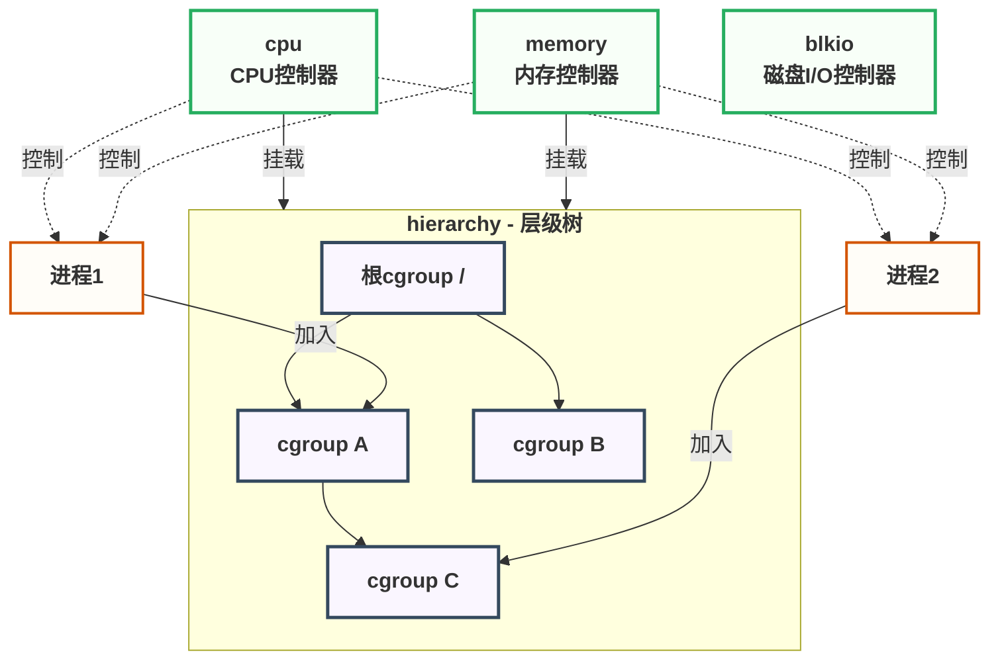
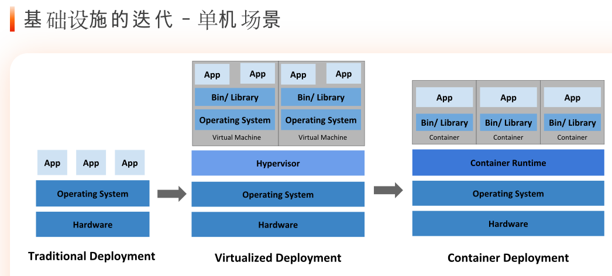
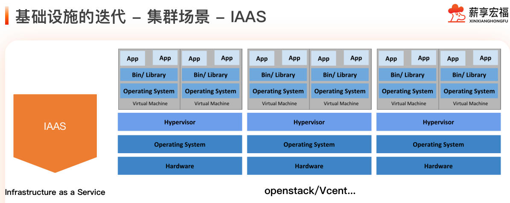
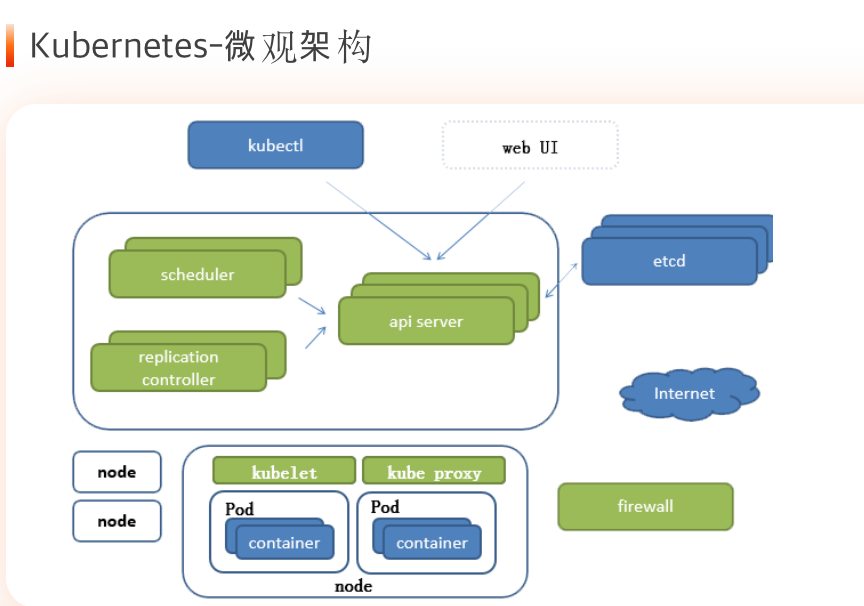
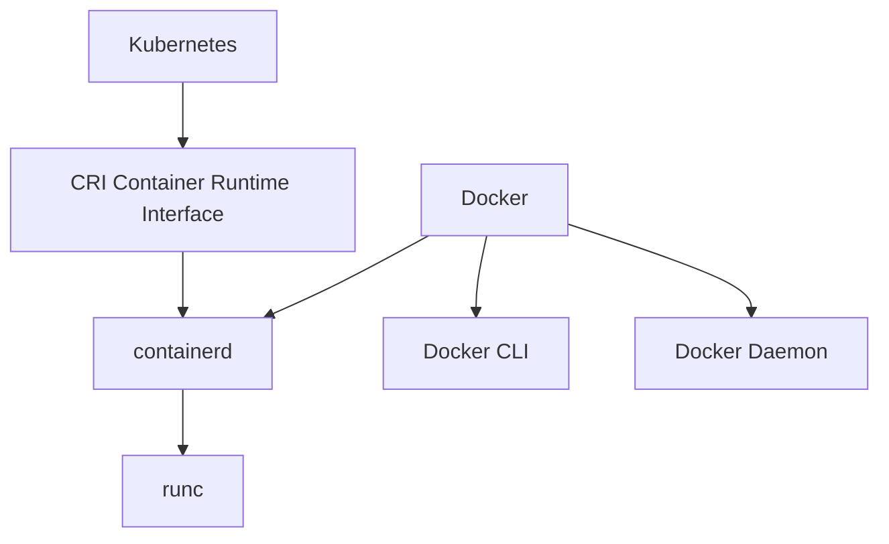

# 云原生


## Docker

### cgroups 的核心概念

------

### 1. cgroup 本身

**定义**：cgroup 是 **控制组** 的缩写。它本质上是 cgroups 系统中的一个节点，用于将进程分组。

**功能**：

- **资源控制**：为一个或多个进程集合分配特定的资源限制，如 CPU 时间、内存使用量等。
- **任务跟踪**：将一个或多个进程的 PID 加入到该 cgroup 中，这样这些进程就受到该 cgroup 规则的约束。
- **提供接口**：在文件系统中，每个 cgroup 都表现为一个目录，目录内包含了一系列用于检查和修改限制的“控制文件”。

**简单来说，cgroup 就是一个“进程组”加上施加在这个组上的“资源参数”的集合。**

------

### 2. Subsystem

**定义**：Subsystem 通常被称为 **控制器**，是真正执行资源限制功能的 kernel 组件。

**功能**：

- 每个 subsystem 负责管理一种特定的系统资源。
- 它需要被挂载到一个 hierarchy 上才能发挥作用。
- 当你在一个 cgroup 的目录中写入一个 subsystem 的控制文件时，该 subsystem 的内核代码就会开始对属于这个 cgroup 的进程实施相应的资源控制。

**常见的 Subsystem 示例**：

- `cpu`：限制 CPU 使用率。
- `memory`：限制内存使用量，并报告内存使用情况。
- `blkio`：为块设备（如磁盘）设定 I/O 限制。
- `cpuset`：为进程分配特定的 CPU 核心和内存节点。
- `pids`：限制进程数量。

**简单来说，subsystem 是真正的“执法者”，它定义了你可以限制什么资源。**

------

### 3. Hierarchy

**定义**：Hierarchy 是一个由 cgroup 构成的 **树形结构**。

**功能**：

- **组织 cgroup**：它提供了一个层级结构，将多个 cgroup 组织起来。顶层的 cgroup 是根 cgroup，下面可以创建子 cgroup。
- **挂载 subsystem**：一个 hierarchy 在创建时，会挂载一个或多个 subsystem。挂载后，这个 hierarchy 中的所有 cgroup 都受这些 subsystem 的控制。
- **继承机制**：子 cgroup 会从其父 cgroup 继承资源限制属性。这意味着你可以设置一个全局限制，然后在子目录中进行更精细的调整。

**一个关键规则**：**一个 hierarchy 可以挂载多个 subsystem，但一个 subsystem 只能挂载到一个 hierarchy 上。** 这是为了避免规则冲突，确保资源限制的单一权威性。

------

### 三者之间的关系与结构图

这三个概念紧密协作：

1. 你首先创建一个 **hierarchy**，并将一个或多个 **subsystem** 挂载上去。
2. 在这个 hierarchy 中，你可以创建多个 **cgroup**，形成树状结构。
3. 你将进程加入到特定的 **cgroup** 中。
4. 对应 **subsystem** 的控制器开始对这些进程进行资源限制。

下面是一个结构图来描述这种关系：



#### 1. **Subsystem 与 Hierarchy 的关系：挂载关系**

**性质**：多对一的绑定关系

- 一个 Hierarchy 可以挂载多个 Subsystem
- 一个 Subsystem 只能挂载到一个 Hierarchy

**实际表现**：

```bash
# 一个 hierarchy 挂载多个 subsystem
mount -t cgroup -o cpu,memory cpu_memory /sys/fs/cgroup/cpu_memory

# 另一个 hierarchy 挂载其他 subsystem  
mount -t cgroup -o blkio disk_io /sys/fs/cgroup/disk_io
```


**设计意义**：

- 避免资源限制规则冲突
- 确保每个资源类型有单一控制源
- 支持按资源类型建立独立的控制策略

#### 2. **Hierarchy 与 Cgroup 的关系：容器关系**

**性质**：树形包含关系

- Hierarchy 是 Cgroup 的组织框架
- Cgroup 是 Hierarchy 中的具体节点
- 父子 Cgroup 形成继承链

**实际表现**：

```
/sys/fs/cgroup/cpu_memory/     (根 cgroup)
├── web_servers/               (子 cgroup)
│   ├── frontend/             (孙 cgroup)
│   └── backend/              (孙 cgroup)
└── database/                 (子 cgroup)
```


**设计意义**：

- 支持资源限制的层级细化
- 实现配置的继承和覆盖
- 便于资源分配的层次化管理

#### 3. **Cgroup 与 Process 的关系：成员关系**

**性质**：分组归属关系

- 一个 Process 在同一个 Hierarchy 中只能属于一个 Cgroup
- 一个 Process 可以同时属于多个不同 Hierarchy 的 Cgroup
- Cgroup 包含一组相关的 Processes

**实际表现**：

```bash
# 将进程加入 cgroup
echo 1234 > /sys/fs/cgroup/cpu_memory/web_servers/cgroup.procs

# 进程可以同时加入另一个 hierarchy 的 cgroup
echo 1234 > /sys/fs/cgroup/disk_io/high_priority/cgroup.procs
```

**设计意义**：

- 支持进程的多维度分类
- 允许不同资源类型的独立控制
- 实现灵活的进程分组策略

#### 4. **Subsystem 与 Process 的关系：控制关系**

**性质**：间接的资源控制关系

- Subsystem 通过其挂载的 Hierarchy 中的 Cgroup 来间接控制 Process
- 控制是实时生效的
- 多个 Subsystem 可以同时对同一个 Process 进行控制

**实际表现**：

```bash
# 设置 cpu 控制参数
echo 512 > /sys/fs/cgroup/cpu_memory/web_servers/cpu.shares

# 设置 memory 控制参数
echo "1G" > /sys/fs/cgroup/cpu_memory/web_servers/memory.limit_in_bytes

# 这些设置会实时影响属于该 cgroup 的所有进程
```

**设计意义**：

- 实现细粒度的资源控制
- 支持多种资源类型的协同管理
- 提供实时的资源限制能力

#### 5. **Cgroup 之间的继承关系**

**性质**：层级配置继承

- 子 Cgroup 继承父 Cgroup 的资源限制配置
- 子 Cgroup 可以覆盖继承的配置（通常只能更严格）
- 配置继承形成资源分配的层次结构

**实际表现**：

```
父 cgroup: memory.limit = 2G
├── 子 cgroup A: memory.limit = 1G  (继承并覆盖为更严格限制)
└── 子 cgroup B: memory.limit = 2G  (完全继承父级限制)
```


## K8S

### 基础设施变革

#### 单机场景



#### 集群 IAAS



#### 集群 PAAS


#### k8s 优势

- **服务发现与负载均衡**：内置的 Service 和 Ingress 对象提供了强大的内部和外部流量路由能力。
- **存储编排**：支持自动挂载各种存储系统（本地、云存储、NFS等）。
- **自动发布与回滚**：通过 Deployment 对象，可以精细控制应用的滚动更新策略，并在出错时一键回滚。
- **自我修复**：能自动重启失败的容器、在节点失效时重新调度容器、杀死不健康的容器等。
- **密钥与配置管理**：提供 Secret 和 ConfigMap 对象，方便管理敏感信息和配置文件，与容器镜像解耦。
- **横向扩缩容**：支持手动和基于 CPU/内存等指标的自动扩缩容。
- **开源**
- **大型规模支持**

#### k8s 微观架构



#### k8s 和 docker 关系



### 安装k3s

#### 彻底卸载 K3s

Agent 节点 (k8s-node1, k8s-node2)	

```bash
sudo /usr/local/bin/k3s-agent-uninstall.sh
```

**Server 节点** (k8s-master)

```bash
sudo /usr/local/bin/k3s-uninstall.sh
```

卸载后，为了确保没有残留，建议在所有节点上手动清理以下目录

```bash
sudo rm -rf /etc/rancher/k3s/
sudo rm -rf /var/lib/rancher/k3s/
sudo rm -rf /opt/cni/
```

#### 安装

master

```bash
curl -sfL https://rancher-mirror.rancher.cn/k3s/k3s-install.sh | INSTALL_K3S_MIRROR=cn sh -s - server --system-default-registry "registry.cn-hangzhou.aliyuncs.com"

sudo cat /var/lib/rancher/k3s/server/node-token

# 检查新的 kubeconfig 文件
sudo cat /etc/rancher/k3s/k3s.yaml

# 如果文件存在，将其复制到用户目录
mkdir -p ~/.kube
sudo cp /etc/rancher/k3s/k3s.yaml ~/.kube/config
sudo chown $(id -u):$(id -g) ~/.kube/config

# 创建目录（如果还没有）
sudo mkdir -p /etc/rancher/k3s/

# 使用 sudo tee 创建配置文件
sudo tee /etc/rancher/k3s/registries.yaml > /dev/null <<'EOF'
mirrors:
  "docker.io":
    endpoint:
      - "https://registry.cn-hangzhou.aliyuncs.com"
  "registry.k8s.io":
    endpoint:
      - "https://registry.cn-hangzhou.aliyuncs.com/google_containers"
configs:
  "registry.cn-hangzhou.aliyuncs.com":
    tls:
      insecure_skip_verify: true
EOF

sudo systemctl restart k3s
```

node

```bash
curl -sfL https://rancher-mirror.rancher.cn/k3s/k3s-install.sh | \
  INSTALL_K3S_MIRROR=cn \
  K3S_URL=https://192.168.139.18:6443 \
  K3S_TOKEN=K105ad8bc480b485edc0c5c759feb4df7af5afa36ae3f756d3acfe3994be2db324e::server:dcea834d4fd33bb6a5b89e4e0c6ccafa \
  sh -
  
# 使用 sudo tee 创建配置文件
sudo tee /etc/rancher/k3s/registries.yaml > /dev/null <<'EOF'
mirrors:
  "docker.io":
    endpoint:
      - "https://registry.cn-hangzhou.aliyuncs.com"
  "registry.k8s.io":
    endpoint:
      - "https://registry.cn-hangzhou.aliyuncs.com/google_containers"
configs:
  "registry.cn-hangzhou.aliyuncs.com":
    tls:
      insecure_skip_verify: true
EOF

sudo systemctl restart k3s
```

### pod

#### Pod 基本概念

- Pod 是 Kubernetes 的**原子调度单位**
- 一个 Pod 包含一个或多个紧密相关的容器
- 这些容器**共享网络命名空间、存储卷和资源**

#### Pod 内的容器关系

**共享的资源：**

- ✅ **网络** - 相同的 IP 地址，localhost 互相访问
- ✅ **存储** - 共享 Volume 挂载
- ✅ **进程空间** - 可以看到彼此的进程
- ✅ **IPC** - 进程间通信
- ✅ **UTS** - 相同的主机名和域名

#### Pause 容器

**Pause 容器**（也称为 Infra 容器）是每个 Pod 的"基础容器"，它在 Pod 生命周期中扮演关键角色

##### Pause 容器的核心价值：

1. **命名空间管理** - 为 Pod 创建共享的运行环境
2. **网络稳定性** - 保持 Pod IP 在容器重启时不变化
3. **进程管理** - 正确处理 Linux PID 1 的职责
4. **资源清理** - 确保 Pod 删除时所有资源被正确清理

### 网络

#### 虚拟网络

在虚拟机软件（如 VMware Workstation, VirtualBox, Hyper-V）中，虚拟网络是主机物理网卡和虚拟机虚拟网卡之间的一个“交换机”。不同的网络模式，本质上是将这个“虚拟交换机”以不同的方式连接到物理网络或主机系统上。

##### 1. 桥接模式

**核心比喻：** 虚拟机就像一台**真实的、新来的电脑**，直接接入了你主机所在的**物理局域网**。

- **工作原理：**
  - 虚拟机的虚拟网卡通过一个“虚拟交换机”直接连接到主机的物理网卡上。
  - 虚拟机会从你所在局域网的路由器（DHCP服务器）那里**获取一个独立的IP地址**，这个IP地址和你的主机、你的手机、你的其他电脑在同一个网段。
  - 在网络拓扑上，虚拟机与宿主机是**平级**的关系。
- **网络连通性：**
  - **虚拟机 ↔ 宿主机：** **可以**
  - **虚拟机 ↔ 局域网其他机器：** **可以**（只要网络策略允许）
  - **虚拟机 ↔ 互联网：** **可以**
- **优点：**
  - 虚拟机完全融入物理网络，就像一台实体机器，非常方便被网络中的其他设备访问。
- **缺点：**
  - **需要局域网内有可用的IP地址**。如果IP地址紧张（如公司网络），可能无法获取IP。
  - **安全性较低**。虚拟机暴露在局域网中，可能面临来自局域网的攻击。
  - 在某些需要认证的网络（如酒店、公司802.1X认证）中可能无法直接使用。
- **典型应用场景：**
  - 需要让局域网内其他用户访问虚拟机中的服务（如Web服务器、文件服务器）。
  - 搭建需要被多台真实机器访问的测试环境。

------

##### 2. NAT 模式

**核心比喻：** 虚拟机就像你家里的**另一台电脑**，通过**主机的路由器（进行了一次地址转换）** 上网。

- **工作原理：**
  - 宿主机同时扮演一个**路由器（NAT设备）** 和 **DHCP服务器** 的角色。
  - 虚拟机会被分配一个与主机物理网络**不同**的私有IP地址（例如 `192.168.x.x`）。
  - 当虚拟机访问外网时，数据包经过主机进行网络地址转换，外部网络看到的源IP是**主机的IP**。
- **网络连通性：**
  - **虚拟机 ↔ 宿主机：** **可以**
  - **虚拟机 ↔ 局域网其他机器：** **默认不可以**（外部机器无法主动发起连接到虚拟机）
  - **虚拟机 ↔ 互联网：** **可以**
- **优点：**
  - **简单方便，开箱即用**。无需任何配置，虚拟机就能上网。
  - **安全性高**。外部网络无法直接访问到虚拟机，形成了一个天然防火墙。
  - **不消耗局域网的IP资源**。
- **缺点：**
  - 默认情况下，局域网内的其他机器无法直接访问虚拟机。
- **典型应用场景：**
  - **最常用的默认模式**。适用于绝大多数只需要上网、下载、浏览网页的虚拟机。
  - 个人学习和测试，不需要被外部访问的服务。
- **补充：NAT网络模式（VMware特有）**
  - 这是NAT模式的增强版。允许多个虚拟机共享一个NAT设备和DHCP服务，同时这些虚拟机之间也**可以相互通信**，形成一个私有的小局域网。

------

##### 3. 仅主机模式

**核心比喻：** 虚拟机和宿主机之间**拉了一根私有的网线**，创建了一个与世隔绝的私有网络。

- **工作原理：**
  - 在宿主机上创建一个完全虚拟的、封闭的网络。
  - 宿主机上会创建一个专用的虚拟网卡（如 `VMnet1`）来连接到这个网络。
  - 虚拟机被分配该虚拟网络的IP地址。这个网络**完全不与物理网络相连**。
- **网络连通性：**
  - **虚拟机 ↔ 宿主机：** **可以**
  - **虚拟机 ↔ 局域网其他机器：** **绝对不可以**
  - **虚拟机 ↔ 互联网：** **绝对不可以**
- **优点：**
  - **极高的隔离性和安全性**。虚拟机完全与外部网络隔离，是纯粹的内部测试环境。
  - 性能最好，因为没有外部流量干扰。
- **缺点：**
  - 虚拟机无法访问外部网络，包括互联网和局域网。
- **典型应用场景：**
  - 构建绝对安全的测试环境，如病毒分析、安全测试。
  - 进行封闭的网络实验，如搭建一个与世隔绝的集群。
  - 需要模拟一个完全独立的网络环境。


#### Kubernetes 网络模型原则

Kubernetes 对网络有一个非常明确和严格的要求，这些要求构成了其网络模型的核心原则。这些原则是任何 Kubernetes 网络解决方案都必须遵守的。

1. **Pod-to-Pod 通信**：
   - **原则**：每个 Pod 都必须拥有一个唯一的、可路由的 IP 地址（称为 Pod IP）。
   - **要求**：**集群中的任何一个 Pod 都必须能够在不使用网络地址转换（NAT）的情况下与任何其他 Pod 进行通信**，无论这两个 Pod 运行在哪个节点（Node）上。
   - **意义**：这意味着 Pod IP 在集群范围内是扁平的，应用程序无需关心它们连接的服务是运行在同一个节点还是不同节点上，就像在同一个物理网络上一样。这极大地简化了应用程序的开发。
2. **Pod-to-Service 通信**：
   - **原则**：Pod 可以通过一个稳定的虚拟 IP 地址（ClusterIP）访问 Kubernetes Service。
   - **要求**：Pod 应该能够在不使用 NAT 的情况下访问 Service。实际上，这通常由 `kube-proxy` 和 CNI 插件协同完成，但 Service 的发现和负载均衡对 Pod 是透明的。
3. **主机命名空间隔离**：
   - **原则**：Pod 看到的网络命名空间（网络栈）应该与节点主机本身看到的网络命名空间隔离。
   - **要求**：Pod 的 IP 地址不一定与节点主机的 IP 地址在同一网段。Pod 运行在它自己的网络沙箱中。

**总结核心思想**：**IP-per-Pod 和 Flat Network**。每个 Pod 就像一个独立的虚拟机或物理机，拥有自己的 IP，并且所有 Pod 在一个大的、扁平的、可直接路由的网络中。

------

#### CNI - 容器网络接口

Kubernetes 本身并不实现网络，它只是定义了网络模型（上述原则）。那么，具体由谁来负责实现这些原则呢？答案就是 CNI 插件。

##### 什么是 CNI？

CNI 是一个 **规范** 和一组 **库**，它定义了容器运行时（如 Containerd, CRI-O）和网络插件之间的接口。

- **核心职责**：当 Kubernetes 创建一个 Pod 时，容器运行时会调用配置好的 CNI 插件，告诉它：“请将这个容器（Pod 内的）加入到网络中”。当 Pod 被删除时，运行时又会调用插件：“请清理这个容器的网络资源”。

##### CNI 的工作流程：

1. **kubelet** 通过 CRI 向 **容器运行时** 发出创建 Pod 的指令。
2. 容器运行时（如 Containerd）创建容器后，发现需要配置网络。
3. 容器运行时调用 **CNI 插件**（例如 `/opt/cni/bin/calico`），并传入两个关键信息：
   - **网络配置**：来自 `/etc/cni/net.d/` 目录的 JSON 文件，定义了使用哪个插件及其参数（如 Calico 的 IP 池）。
   - **容器上下文**：如容器 ID、网络命名空间路径等。
4. **CNI 插件** 执行具体操作：
   - 分配一个 IP 地址。
   - 创建一对 veth pair（虚拟以太网设备），一头放入容器的网络命名空间（通常命名为 `eth0`），另一头留在主机的根命名空间。
   - 设置路由规则、ARP 表等。
   - 可能还会设置网络策略所需的必要规则。
5. 插件将操作结果（如分配到的 IP 地址）返回给容器运行时。
6. **kubelet** 最终获取到 Pod 的 IP 地址，并更新到 Pod 的 `status.podIP` 字段。

**简单来说，CNI 是 Kubernetes 网络生态的“粘合剂”和“标准协议”，它允许不同的网络解决方案（插件）无缝地接入 Kubernetes。**

------

#### Kubernetes 网络模型实现方式

要实现上述的扁平网络模型，CNI 插件通常采用以下几种主流技术：

1. **Overlay 网络（隧道）**
   - **原理**：在主机网络之上再构建一个“虚拟网络”。Pod 之间的数据包被封装在宿主机的网络数据包中进行传输，到达目标节点后再解封装。
   - **常见技术**：VXLAN, IP-in-IP, GRE。
   - **优点**：不依赖底层物理网络结构，只要有 IP 连通性就能工作，跨数据中心/云环境部署简单。
   - **缺点**：封装和解封装有额外的性能开销（通常轻微）。
   - **代表插件**：Flannel (VXLAN 模式), Calico (可配置 VXLAN 模式)。
2. **Underlay 网络（BGP 路由）**
   - **原理**：使用路由协议（如 BGP），让每个节点都成为一个路由器，直接向底层网络宣告 Pod 的 IP 地址段。这样，物理网络设备（交换机、路由器）就知道如何将数据包直接路由到正确的节点。
   - **优点**：高性能，没有封装开销，数据包直接路由。
   - **缺点**：要求底层网络设备支持 BGP（或在云环境中需要特定支持），配置相对复杂。
   - **代表插件**：**Calico**（默认的 BGP 模式）, Kube-router。
3. **L2 网络（桥接/ARP）**
   - **原理**：在二层网络上，通过桥接或 ARP 代理等方式，让所有节点处于同一个大的广播域。
   - **优点**：配置简单，在某些简单环境中可用。
   - **缺点**：扩展性差，广播风暴风险，不适合大规模集群。
   - **代表插件**：Flannel (host-gw 模式，严格说是 L3)，一些简单的自定义插件。

------

#### Calico 架构详解

Calico 是目前最流行、功能最全面的 Kubernetes CNI 插件之一。它以其高性能和强大的网络策略能力而闻名。

##### 核心组件

一个典型的 Calico 安装包含以下组件：

1. **Calico CNI 插件** (`calico`, `calico-ipam`)
   - 位于每个节点的 `/opt/cni/bin/` 目录下。
   - 负责 Pod 的网络连接和 IP 地址分配（IPAM）。
2. **Felix**
   - 每个节点上运行的 **DaemonSet** 代理。
   - **核心职责**：
     - 编写路由规则（到本节点 Pod 的路由）。
     - 编写 ACLs（访问控制列表）以实现 Calico 的网络策略。
     - 管理网络接口（例如，创建 veth pair）。
     - 报告节点的网络健康状态。
3. **BIRD**
   - 每个节点上运行的路由守护进程。
   - **核心职责**：与集群中的其他 BIRD 实例（或外部物理路由器）交换 BGP 路由信息。
   - 它负责宣告 “到我这个节点的 Pod CIDR 的路径是经过我这个节点的 IP”。
   - 这使得整个集群乃至外部网络都知道如何路由到任何一个 Pod IP。
4. **Confd**（可选，在非 K8s API 模式下使用）
   - 监视配置变化（如 Calico 的全局配置），并动态生成 BIRD 的配置文件。
5. **Calico API Server** 和 **Typha**
   - **Calico API Server**：作为 Kubernetes API 的扩展，用于存储 Calico 的专属资源（如 NetworkPolicy, IPPool）。它提供了更高效、更强大的 API 来管理大量网络策略。
   - **Typha**：一个数据同步代理。在大规模集群中，当有成千上万个节点时，每个节点的 Felix 都直接连接 API Server 会造成巨大压力。Typha 作为中间层，代表所有 Felix 与 API Server 通信，然后将数据分发给各个 Felix，**极大地降低了 API Server 的负载**。
6. **CNI 配置插件**
   - 位于 `/etc/cni/net.d/` 的配置文件，告诉 kubelet 使用 Calico 插件。

##### 数据流（以默认 BGP 模式为例）

1. **Pod A**（在 Node 1 上）想访问 **Pod B**（在 Node 2 上）。
2. Pod A 发出的数据包通过其 `eth0` -> veth pair -> 主机 Node 1 的根命名空间。
3. 主机 Node 1 的路由表由 Felix 和 BIRD 维护，其中有一条规则：“目标网段是 Pod B 的 IP 所在网段，请通过网关 Node 2 的 IP 发送”。
4. 数据包通过物理网络直接发送到 Node 2。
5. Node 2 收到数据包，查看自己的路由表，发现目标 IP（Pod B）就在本机的一个 veth 接口上，于是将数据包转发给 Pod B。

**整个过程没有封包和解包，是纯粹的三层路由，因此性能极高。**

###### Calico 的工作模式

- **BGP 模式（默认）**：如上所述，高性能，要求底层网络允许 BGP 对等。
- **IP-in-IP 模式**：一种 Overlay 模式，当节点间网络不支持直接路由 Pod IP 时，Calico 可以用 IP-in-IP 隧道封装数据包。
- **VXLAN 模式**：另一种 Overlay 模式，比 IP-in-IP 更通用，在某些网络设备上兼容性更好。

### 资源清单


## 参考文档

https://www.lixueduan.com/categories/docker/

https://github.com/lixd/mydocker


