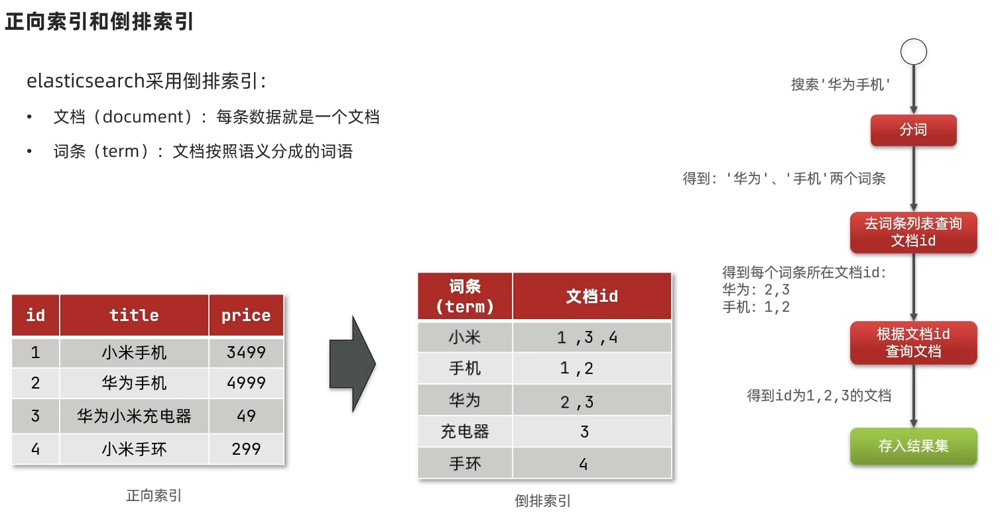

# ES

## 什么是 ELK？

**ELK** 是 Elastic Stack 的核心组件，包含三个开源工具：

1. **Elasticsearch**：分布式搜索和分析引擎（核心）。
2. **Logstash**：数据收集、处理和传输管道（负责清洗和转发数据）。
3. **Kibana**：数据可视化和管理界面（提供图表、仪表盘等）。

它们协作完成从数据采集、存储到分析展示的全流程，常用于日志管理、业务监控、安全分析等场景。

## 倒排索引

**倒排索引**是搜索引擎的核心数据结构，专门为**快速全文检索**设计。它与传统数据库的“正排索引”（按文档找内容）相反，是**按关键词找文档**的索引机制，能大幅提升搜索效率



## 安装

创建 docker-compose.yml 文件

```yaml
version: '3.8'  # 声明 Compose 文件版本

services:
  elasticsearch:
    image: elasticsearch:8.12.0  # 使用 Elasticsearch 8.12.0 官方镜像
    container_name: elasticsearch  # 指定容器名称
    environment:
      - discovery.type=single-node  # 单节点模式（无需集群发现）
      - ES_JAVA_OPTS=-Xms1g -Xmx1g  # 设置 JVM 堆内存为 1GB（按需调整）
      - xpack.security.enabled=false  # 关闭安全认证（仅限开发环境！）
    volumes:
      - es_data:/usr/share/elasticsearch/data  # 数据持久化到 Docker 卷 `es_data`
    ports:
      - "9200:9200"  # 暴露 REST API 端口（HTTP 交互）
      - "9300:9300"  # 暴露节点间通信端口（集群用，单节点模式下可选）
    networks:
      - elk-network  # 连接到自定义网络 `elk-network`

  logstash:
    image: logstash:8.12.0  # 使用 Logstash 8.12.0 镜像（与 ES 版本一致）
    container_name: logstash
    volumes:
      - ./logstash.conf:/usr/share/logstash/pipeline/logstash.conf  # 挂载 Logstash 配置文件
    ports:
      - "5044:5044"  # 接收来自 Filebeat/其他客户端的日志数据
    depends_on:
      - elasticsearch  # 确保 Elasticsearch 先启动
    networks:
      - elk-network  # 同一网络内可通过服务名通信

  kibana:
    image: kibana:8.12.0
    container_name: kibana
    ports:
      - "5601:5601"  # Kibana 可视化界面访问端口
    environment:
      - ELASTICSEARCH_HOSTS=http://elasticsearch:9200  # 指定 Elasticsearch 地址
    depends_on:
      - elasticsearch  # 依赖 Elasticsearch 服务
    networks:
      - elk-network

volumes:
  es_data:
    driver: local  # 本地存储卷，保证 Elasticsearch 数据持久化

networks:
  elk-network:
    driver: bridge  # 创建桥接网络，实现容器间通信
```

创建 Logstash 配置文件
在 docker-compose.yml 同级目录下创建 logstash.conf

```js
input {
  tcp {
    port => 5044       # 监听 5044 端口接收数据
    codec => json      # 解析输入数据为 JSON 格式
  }
}

output {
  elasticsearch {
    hosts => ["http://elasticsearch:9200"]  # 输出到 Elasticsearch
    index => "logs-%{+YYYY.MM.dd}"          # 按日期动态创建索引（如 logs-2024.06.20）
  }
}
```

 启动 ELK 服务

```bash
# 创建并启动容器
docker compose up -d

# 查看日志（可选）
docker compose logs -f
```

验证服务运行

- **Elasticsearch**

  ```bash
  curl http://localhost:9200
  ```

  若返回 JSON 集群信息，则表示成功。

- **Kibana**
  浏览器访问 `http://localhost:5601`，进入 Kibana 控制台。

测试 ELK 流程
1. 通过 Logstash 发送测试数据

  ```
  echo '{"message": "Hello ELK on Mac M1!"}' | nc localhost 5044
  ```
2. 在 Kibana 中查看数据
   1、进入 Kibana → Management → Stack Management → Index Management，确认索引 logs-YYYY.MM.dd 已创建。

   2、进入 Analytics → Discover，选择索引模式 logs-*，查看日志数据。

## 分词器

分词器是**文本处理的核心工具**，负责将一段连续的文本（如句子、段落）拆分成独立的、有意义的词汇单元（称为 **Token**）。这些词汇单元会被用于构建索引、执行搜索、分析语义等操作。

- **核心任务**：将文本转换为适合计算机处理的离散单元。
- **适用场景**：搜索引擎、自然语言处理（NLP）、日志分析等。

### **常见分词器类型**

| 分词器类型        | 特点                                                         | 适用场景                 |
| :---------------- | :----------------------------------------------------------- | :----------------------- |
| **标准分词器**    | 按空格和标点切分，支持英文                                   | 英文文本处理             |
| **IK 分词器**     | 专为中文设计，支持细粒度（`ik_max_word`）和智能模式（`ik_smart`） | 中文搜索引擎、日志分析   |
| **N-gram 分词器** | 按固定长度滑动窗口切分（如“苹果” → `["苹", "苹果", "果"]`）  | 模糊匹配、自动补全       |
| **拼音分词器**    | 将中文转换为拼音（如“北京” → `["beijing", "bj"]`）           | 支持拼音搜索的场景       |
| **正则分词器**    | 通过正则表达式切分文本                                       | 处理特定格式的日志或数据 |

### 安装 IK 分词器

#### 一、目录结构准备

假设本地已下载 `elasticsearch-analysis-ik-8.12.0.zip` 文件，建议按以下目录结构组织：

```bash
your-project/
├── docker-compose.yml    # 原有 Compose 文件
├── Dockerfile            # 新增的 Dockerfile
├── elasticsearch-analysis-ik-8.12.0.zip  # 本地 IK 分词器文件
└── logstash.conf         # Logstash 配置文件（已有）
```

------

#### 二、编写 Dockerfile

创建 `Dockerfile` 文件，内容如下：

```dockerfile
FROM elasticsearch:8.12.0

COPY elasticsearch-analysis-ik-8.12.0.zip /tmp/ik.zip

# 安装插件
RUN bin/elasticsearch-plugin install -b file:///tmp/ik.zip

# 切换到 root 用户删除文件
USER root
RUN rm -f /tmp/ik.zip

# 切换回 elasticsearch 用户（保持镜像安全性）
USER elasticsearch
```

------

#### 三、Dockerfile 语法详解

| 指令      | 作用                                                         |
| :-------- | :----------------------------------------------------------- |
| `FROM`    | 指定基础镜像（必须为第一个指令），这里基于 `elasticsearch:8.12.0`。 |
| `COPY`    | 将本地文件复制到镜像中，格式为 `COPY <源路径> <镜像内目标路径>`。 |
| `RUN`     | 在构建镜像时执行命令，这里用于安装插件和清理临时文件。       |
| `file://` | 表示从镜像内部文件路径安装插件（非 HTTP 下载）。             |
| `-b` 参数 | 启用批处理模式，避免交互式确认。                             |

------

#### 四、修改 docker-compose.yml

修改 `elasticsearch` 服务的配置，使用自定义镜像：

```dockerfile
services:
  elasticsearch:
    # 改为使用自定义镜像（通过 Dockerfile 构建）
    image: elasticsearch-ik:8.12.0  # 自定义镜像标签
    container_name: elasticsearch
    # 其他配置保持不变...
```

------

#### 五、完整操作步骤

1. **构建自定义镜像**
   在 `Dockerfile` 所在目录执行：

   ```
   docker build -t elasticsearch-ik:8.12.0 .
   ```

2. **更新并启动服务**

   ```bash
   # 停止并删除旧容器（如果已运行）
   docker compose down
   
   # 启动所有服务（使用新镜像）
   docker compose up -d
   ```

3. **验证 IK 分词器安装成功**

   - **方法1：查看插件列表**

     ```bash
     docker exec elasticsearch bin/elasticsearch-plugin list
     ```

     输出应包含：`analysis-ik`

   - **方法2：测试分词效果**

     ```json
     # 测试分词器
     POST /_analyze
     {
       "text":"我爱北京天安门",
       "analyzer":"ik_max_word"
     }
     ```

     成功输出示例：

     ```json
     {
       "tokens": [
         {
           "token": "我",
           "start_offset": 0,
           "end_offset": 1,
           "type": "CN_CHAR",
           "position": 0
         },
         {
           "token": "爱",
           "start_offset": 1,
           "end_offset": 2,
           "type": "CN_CHAR",
           "position": 1
         },
         {
           "token": "北京",
           "start_offset": 2,
           "end_offset": 4,
           "type": "CN_WORD",
           "position": 2
         },
         {
           "token": "天安门",
           "start_offset": 4,
           "end_offset": 7,
           "type": "CN_WORD",
           "position": 3
         },
         {
           "token": "天安",
           "start_offset": 4,
           "end_offset": 6,
           "type": "CN_WORD",
           "position": 4
         },
         {
           "token": "门",
           "start_offset": 6,
           "end_offset": 7,
           "type": "CN_CHAR",
           "position": 5
         }
       ]
     }
     ```

## Mapping

### **一、Mapping 的常见属性**

| 属性                  | 说明                                                   | 示例场景                                                    |
| :-------------------- | :----------------------------------------------------- | :---------------------------------------------------------- |
| **`type`**            | 字段的数据类型（如 `text`、`keyword`、`integer` 等）。 | 决定字段的存储和查询方式。                                  |
| **`index`**           | 控制字段是否被索引（默认 `true`）。                    | 设为 `false` 时，字段不可搜索（但可存储）。                 |
| **`analyzer`**        | 指定写入时的分词器（如 `ik_max_word`）。               | 中文文本的分词处理。                                        |
| **`search_analyzer`** | 指定搜索时的分词器（默认与 `analyzer` 一致）。         | 优化搜索行为（如写入时细粒度分词，搜索时粗粒度）。          |
| **`fields`**          | 为字段定义多子字段（如同时支持全文检索和精确匹配）。   | `text` 类型字段添加 `keyword` 子字段用于聚合。              |
| **`dynamic`**         | 控制动态映射策略（`true`/`false`/`strict`）。          | 禁止未定义的字段（`strict` 模式），避免脏数据。             |
| **`format`**          | 指定日期格式（仅限 `date` 类型）。                     | `"format": "yyyy-MM-dd HH:mm:ss||epoch_millis"`。           |
| **`ignore_above`**    | 限制 `keyword` 字段的最大长度（超长部分不索引）。      | 防止超长字符串（如日志中的 URL）浪费存储。                  |
| **`copy_to`**         | 将多个字段的值复制到目标字段，实现联合搜索。           | 将 `first_name` 和 `last_name` 复制到 `full_name` 字段。    |
| **`norms`**           | 是否存储字段长度信息（默认 `true`，用于相关性评分）。  | 对不关心相关性的字段（如 `keyword`）设为 `false` 节省空间。 |
| **`doc_values`**      | 是否启用列式存储（默认 `true`，用于排序和聚合）。      | 对不参与聚合的字段设为 `false` 节省磁盘空间。               |
| **`null_value`**      | 指定字段为 `null` 时的默认值。                         | 将缺失的 `status` 字段填充为 `"unknown"`。                  |

------

### **二、Type 的常见类型**

#### **1. 基础类型**

| 类型          | 说明                                                | 示例场景                            |
| :------------ | :-------------------------------------------------- | :---------------------------------- |
| **`text`**    | 全文检索字段，默认分词。支持模糊匹配、短语搜索。    | 文章内容、商品描述。                |
| **`keyword`** | 精确值字段，不分词。常用于过滤、聚合、排序。        | 订单状态（如 `"paid"`）、标签分类。 |
| **`long`**    | 64位整数（范围：`-2^63` ~ `2^63-1`）。              | 商品库存、用户积分。                |
| **`integer`** | 32位整数（范围：`-2^31` ~ `2^31-1`）。              | 年龄、订单数量。                    |
| **`short`**   | 16位整数（范围：`-32768` ~ `32767`）。              | 小型计数器（如页面访问次数）。      |
| **`byte`**    | 8位整数（范围：`-128` ~ `127`）。                   | 状态标志位（如 `0`/`1`）。          |
| **`double`**  | 双精度浮点数。                                      | 商品价格、地理坐标。                |
| **`float`**   | 单精度浮点数。                                      | 温度、评分。                        |
| **`boolean`** | 布尔值（`true`/`false`）。                          | 是否上架、用户是否激活。            |
| **`date`**    | 日期类型，支持多种格式（如 `yyyy-MM-dd`、时间戳）。 | 订单创建时间、日志时间戳。          |
| **`binary`**  | 二进制数据（Base64 编码存储）。                     | 加密内容、小文件（如图片缩略图）。  |

#### **2. 复杂类型**

| 类型            | 说明                                             | 示例场景                                                     |
| :-------------- | :----------------------------------------------- | :----------------------------------------------------------- |
| **`object`**    | 嵌套 JSON 对象（自动扁平化处理）。               | 用户信息中的地址（`{ "city": "北京", "street": "中关村" }`）。 |
| **`nested`**    | 嵌套对象类型（独立索引子对象，解决扁平化问题）。 | 订单中的商品列表（每个商品独立索引，避免属性交叉匹配）。     |
| **`flattened`** | 将整个 JSON 对象存储为单个字段（避免字段爆炸）。 | 动态元数据（如日志中的可变标签）。                           |

#### **3. 地理类型**

| 类型            | 说明                                                  | 示例场景             |
| :-------------- | :---------------------------------------------------- | :------------------- |
| **`geo_point`** | 经纬度坐标（格式：`{ "lat": 40.0, "lon": 116.0 }`）。 | 用户定位、商家地址。 |
| **`geo_shape`** | 复杂地理形状（如多边形、线）。                        | 地理围栏、配送范围。 |

#### **4. 特殊类型**

| 类型              | 说明                           | 示例场景                                      |
| :---------------- | :----------------------------- | :-------------------------------------------- |
| **`ip`**          | IPv4/IPv6 地址。               | 访问日志中的客户端 IP。                       |
| **`completion`**  | 自动补全建议（用于搜索建议）。 | 搜索框的自动补全（如商品名称）。              |
| **`token_count`** | 统计字段的分词数量。           | 分析文章长度（如统计 `content` 字段的词数）。 |

------

### **三、使用示例**

#### 1. **基础 Mapping 定义**

```json
PUT /products
{
  "mappings": {
    "properties": {
      "title": {
        "type": "text",
        "analyzer": "ik_max_word",  // 中文分词
        "fields": {
          "raw": { "type": "keyword" }  // 精确匹配子字段
        }
      },
      "price": { "type": "double" },
      "tags": { "type": "keyword" },
      "created_at": {
        "type": "date",
        "format": "yyyy-MM-dd HH:mm:ss"
      },
      "location": { "type": "geo_point" }
    }
  }
}
```

#### 2. **复杂类型（`nested`）**

```json
PUT /orders
{
  "mappings": {
    "properties": {
      "order_id": { "type": "keyword" },
      "products": {
        "type": "nested",  // 嵌套类型
        "properties": {
          "product_id": { "type": "keyword" },
          "quantity": { "type": "integer" }
        }
      }
    }
  }
}
```

## 索引库操作（Index Management）

### 1. **创建索引库**

**语法**：

```bash
PUT /索引名
{
  "settings": { ... },  // 索引设置（分片、副本等）
  "mappings": { ... }   // 字段映射规则
}
```

**示例**：创建商品索引 `products`，定义 `title` 字段使用 IK 分词器

```json
PUT /products
{
  "settings": {
    "number_of_shards": 1,     // 主分片数
    "number_of_replicas": 0    // 副本分片数（开发环境可设为0）
  },
  "mappings": {
    "properties": {
      "title": {
        "type": "text",
        "analyzer": "ik_max_word"
      },
      "price": { "type": "double" },
      "create_time": { "type": "date" }
    }
  }
}
```

**成功响应**：

```json
{
  "acknowledged": true,
  "shards_acknowledged": true,
  "index": "products"
}
```

------

### 2. **删除索引库**

**语法**：

```
DELETE /索引名
```

**示例**：删除 `products` 索引

```
DELETE /products
```

**响应**：

```
{
  "acknowledged": true
}
```

**注意**：删除索引不可逆，需谨慎操作！

------

### 3. **修改索引库**

Elasticsearch **不支持直接修改现有索引的 Mapping**，需通过以下方法间接修改：

- **添加新字段**：直接插入数据，ES 自动扩展 Mapping（需开启动态映射）。
- **重建索引**：使用 `Reindex API` 迁移数据到新索引。

**示例**：为 `products` 索引添加 `description` 字段

```json
PUT /products/_doc/1
{
  "title": "智能手机",
  "price": 2999.0,
  "description": "高性能旗舰手机"  // 新字段自动加入 Mapping
}
```

**验证 Mapping**：

```json
GET /products/_mapping
```

------

### 4. **查询索引库信息**

**语法**：

```
GET /索引名
```

**示例**：查看 `products` 索引的详细信息

```
GET /products
```

**响应**：

```json
{
  "products": {
    "aliases": {},
    "mappings": { ... },
    "settings": { ... }
  }
}
```

------

## 文档操作（Document CRUD）

### 1. **添加文档**

**语法**（指定文档 ID）：

```json
PUT /索引名/_doc/文档ID
{
  "字段1": "值1",
  "字段2": "值2"
}
```

**语法**（自动生成文档 ID）：

```json
POST /索引名/_doc
{
  "字段1": "值1",
  "字段2": "值2"
}
```

**示例**：向 `products` 索引添加一条文档

```json
PUT /products/_doc/1
{
  "title": "无线耳机",
  "price": 599.0,
  "create_time": "2024-06-20"
}
```

**响应**：

```json
{
  "_index": "products",
  "_id": "1",
  "_version": 1,
  "result": "created"
}
```

------

### 2. **查询文档**

**语法**（按 ID 查询）：

```
GET /索引名/_doc/文档ID
```

**示例**：查询 ID 为 `1` 的文档

```
GET /products/_doc/1
```

**响应**：

```json
{
  "_index": "products",
  "_id": "1",
  "_version": 1,
  "_source": {
    "title": "无线耳机",
    "price": 599.0,
    "create_time": "2024-06-20"
  }
}
```

**语法**（搜索所有文档）：

```
GET /索引名/_search
```

------

### 3. **更新文档**

##### **全量更新**（替换整个文档）

```json
PUT /索引名/_doc/文档ID
{
  "字段1": "新值",
  "字段2": "新值"
}
```

##### **部分更新**（仅修改指定字段）

```json
POST /索引名/_update/文档ID
{
  "doc": {
    "字段": "新值"
  }
}
```

**示例**：修改文档 `1` 的价格

```
POST /products/_update/1
{
  "doc": {
    "price": 549.0
  }
}
```

**响应**：

```json
{
  "_index": "products",
  "_id": "1",
  "_version": 2,
  "result": "updated"
}
```

------

### 4. **删除文档**

**语法**：

```
DELETE /索引名/_doc/文档ID
```

**示例**：删除 ID 为 `1` 的文档

```
DELETE /products/_doc/1
```

**响应**：

```json
{
  "_index": "products",
  "_id": "1",
  "_version": 3,
  "result": "deleted"
}
```

------

### 5. 批量操作（Bulk API）

**语法**：

```bash
POST /_bulk
{ "操作类型": { "_index": "索引名", "_id": "文档ID" } }
{ "字段": "值" }
```

**支持的操作类型**：

- `create`：创建文档（ID 不存在）
- `index`：创建或替换文档
- `update`：部分更新
- `delete`：删除文档

**示例**：批量插入两条文档

```
POST /_bulk
{ "index": { "_index": "products", "_id": "2" } }
{ "title": "智能手表", "price": 1299.0 }
{ "index": { "_index": "products", "_id": "3" } }
{ "title": "蓝牙音箱", "price": 199.0 }
```

### 6. 注意事项

1. **索引不可变性**

   - Mapping 中的字段类型一旦设定，无法直接修改（需通过 `Reindex API` 重建索引）。

2. **文档版本控制**

   - 每次更新文档，`_version` 值递增，可用于乐观锁控制。

3. **批量操作性能**

   - 使用 `Bulk API` 处理大量数据时，建议每批 5-15 MB。

4. **安全认证**

   - 若启用 Elasticsearch 安全功能（`xpack.security.enabled=true`），需在请求头中添加认证信息：

     ```bash
     curl -u username:password -XGET http://localhost:9200/...
     ```


