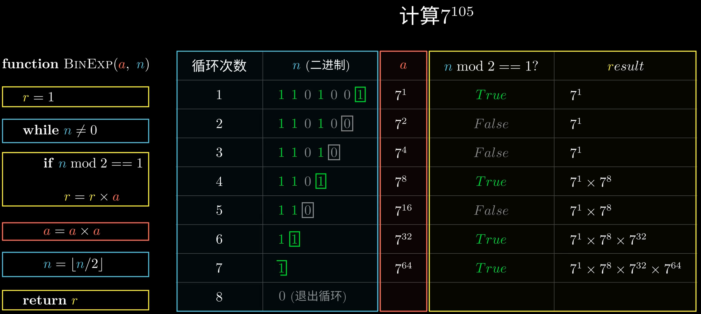

# Leetcode

> 慎用staic刷题：
>
> 因为leetcode上面每个测试用例会使用之前的同一个类，使用静态变量会导致静态变量的值不被初始话从而使得本次测试用例，之前的静态变量，从而导致错误发生。

## Trie

### 下标转换

```java
int index = ch - 'a';
```

### 大小写转换

```java
char ch=UP+'a'-'A' 大写转小写
char ch=LO-('a'-'A') 小写转大写
```

## KMP

```
一个人能走的多远不在于他在顺境时能走的多快，而在于他在逆境时多久能找到曾经的自己。
                                                            ————KMP
```

## 完全二叉树

朴素

```java
如果树为空，返回false

如果树不为空，开始层序遍历二叉树
1、node.left!=null && node.right!=null 将node.left、node.right按顺序入队
2、node.left==null && node.right!=null 返回false
3、node.left!=null && node.right==null 或者 node.left==null && node.right==null,如果node.left!=null 入队，那么后面遍历的节点都为叶子节点，才是完全二叉树，否则返回false

private boolean isCompleteBinaryTree(Node<E> node) {
    if (node == null) return false;
    Queue<Node<E>> queue = new LinkedList<>();
    queue.offer(node);
    boolean isLeaf = false;
    while (!queue.isEmpty()) {
        node = queue.poll();
        if (isLeaf && !node.isLeaf()) return false;
        if (node.leftNode != null && node.rightNode != null) {
            queue.offer(node.leftNode);
            queue.offer(node.rightNode);
        } else if (node.leftNode == null && node.rightNode != null) {
            return false;
        } else {
            if (node.leftNode != null) {
                queue.offer(node.leftNode);
            }
            isLeaf = true;
        }
    }
    return true;
}
```

精简

```java
private boolean isCompleteBinaryTree(Node<E> node){
    if (node == null) return false;
    Queue<Node<E>> queue = new LinkedList<>();
    queue.offer(node);
    boolean isLeaf = false;
    while (!queue.isEmpty()) {
        node = queue.poll();
        if (isLeaf && !node.isLeaf()) return false;
        if (node.leftNode != null) {
            queue.offer(node.leftNode);
        } else if (node.rightNode!=null){
            return false;
        }

        if (node.rightNode!=null){
            queue.offer(node.rightNode);
        }else {
            isLeaf=true;
        }
    }
    return true;
 }
```

## 数学

### 快速幂

https://www.bilibili.com/video/BV16Z4y1M7y1/?spm_id_from=333.999.0.0&vd_source=611b1ef124271a22e110feed4df29d1b


